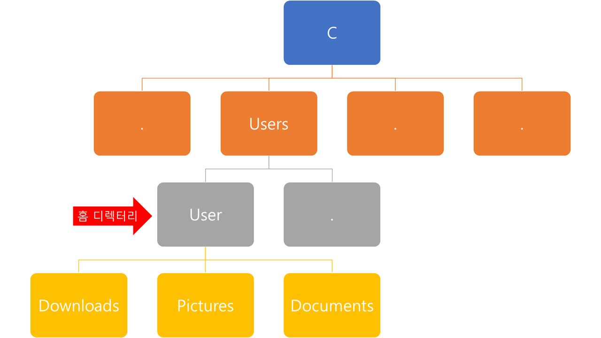
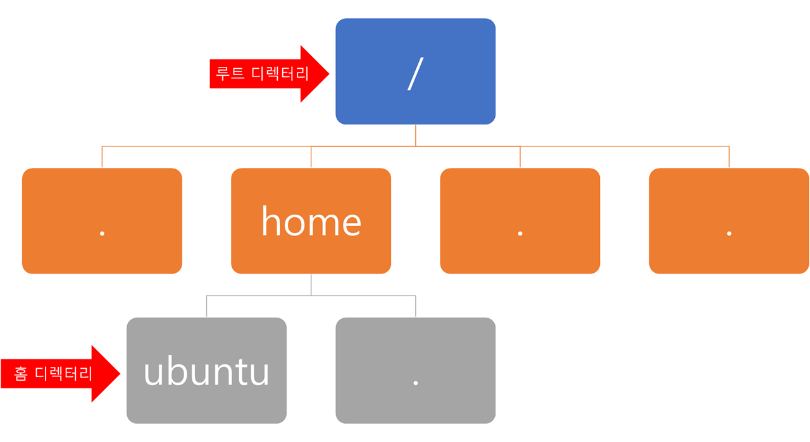

- [리눅스 기본 명령어](#리눅스-기본-명령어)
  - [리눅스 프롬프트 구조](#리눅스-프롬프트-구조)
    - [홈 디렉터리](#홈-디렉터리)

# 리눅스 기본 명령어

## 리눅스 프롬프트 구조

- 사용자 이름@서버 주소:~$
  - AWS → 우분투 생성하는 과정에서 자동으로 `ubuntu`라는 사용자 이름 생성
  - Putty로 접속 → 자동으로 `ubuntu`라는 이름으로 로그인
- `~` : 현재 디렉토리 위치
  - 디폴트 → 사용자 홈 디렉토리 위치
  - = Windows : 파일탐색기 → 제목 표시줄
- 프롬프트
  - `$` : 일반 유저
  - `#` : root 유저 → 포맷, 사용자 삭제 등 권한이 센 작업 가능

### 홈 디렉터리

- Windows
  
  - 홈 디렉터리 : `C:\Users\User` = 내 PC
    - User : 사용자 이름
      - `C:\Users\User\Downloads` = 내 PC → 다운로드
      - `C:\Users\User\Pictures` = 내 PC → 사진
      - `C:\Users\User\Documents` = 내 PC → 문서
- 리눅스
  
  - 홈 디렉터리 : `/home/ubuntu` = `~`
    - ubuntu : 사용자 이름
