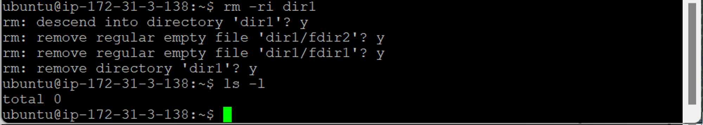
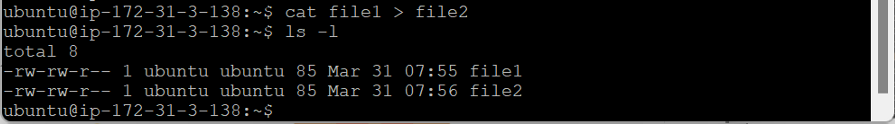

- [리눅스 기본 명령어](#리눅스-기본-명령어)
  - [리눅스 기본 명령어](#리눅스-기본-명령어-1)
    - [`pwd` (print working directory)](#pwd-print-working-directory)
    - [`ls` (list)](#ls-list)
    - [`mkdir` (make directory)](#mkdir-make-directory)
    - [`touch`](#touch)
    - [`clear`](#clear)
    - [`cat` (concatenate)](#cat-concatenate)
    - [`cd` (change directory)](#cd-change-directory)
    - [`rm` (remove)](#rm-remove)
    - [`mv` (move)](#mv-move)

# 리눅스 기본 명령어

## 리눅스 기본 명령어

### `pwd` (print working directory)

- 현재 디렉터리의 전체 경로 출력
  
  - password 약자 아님

### `ls` (list)

- 해당 디렉터리에 있는 파일 목록 나열
  
  - 작업한 게 없기 때문에 아무것도 안 나옴
  - = Windows : `dir`
- `ls -a` : 숨김 파일 보기
  
  - 디렉터리나 파일명이 `.`으로 시작 → 자동으로 숨김 파일이 됨 (원래 보여지지 않음)
    - 리눅스 → 별도의 숨김 파일이라는 속성이 존재하지 않음
- `ls -l` : 자세히 보기 (평소에 많이 사용됨)
  
  - 작업한 게 없기 때문에 아무것도 안 나옴
  - = Windows : 파일 탐색기 → 보기 → 자세히
- `ls -al` : 숨김 파일 자세히 보기
  
  - 파일 유형 : 데이터의 성격
    - 디렉터리 : `d`로 시작
    - 파일 : `-`로 시작
  - 파일 허가권
  - 링크 수
  - 파일 소유권 : 파일을 소유한 사용자와 그룹
    - root : ubuntu 사용자로 로그인한 상태에서는 마음대로 건들 수 없음
    - ubuntu
  - 파일 크기(Byte)
  - 마지막 변경 날짜/시간
  - 파일 이름
- `ls -m` : 자료들이 `,`로 구분해서 나옴

  

- `ls -F` : 디렉터리와 파일을 구분해서 나옴
  
  - 디렉터리 : 이름 뒤에 `/`가 붙음
  - 파일 : 그냥 이름만 나옴

### `mkdir` (make directory)

- `mkdir (dir_name)` : 새 디렉터리(폴더) 생성
  
  - 디폴트 → 미국 시간으로 세팅 (값 조정 후 리부팅 가능)

### `touch`

- `touch (file_name)` : 크기 0인 새 파일 생성 (빈 껍데기)
  
  - 이미 존재하는 경우 수정 시간 변경
  - Windows : 우클릭 → 새로 만들기 → 텍스트 문서

### `clear`

- 명령창을 깨끗하게 지워줌
  
  

### `cat` (concatenate)

- `cat (file_name)` : 텍스트로 작성된 파일을 화면에 출력
  
  - nano로 굳이 들어가지 않아도 파일 내용 화면 출력 가능
- `cat (file_name1) > (file_name2)` : 출력 위치 변경
  
  - `file1` 내용을 `file2`에 씀
  - 파일 생성과 동시에 복사

### `cd` (change directory)

- `cd (dir_name)` : 디렉터리 이동 (많이 사용)
  
  
  - 현재 위치 : 홈 디렉터리 아래의 dir1에 있음
  - `.` : 현재 디렉터리
  - `..` : 현재의 상위 디렉터리
  - `touch (file_name)` : 파일 생성
    
    
- `cd` : 홈 디렉터리로 이동
  
  
  - 어디에 있든 홈 디렉터리로 이동

### `rm` (remove)

- `rm (file_name | dir_name)` : 파일이나 디렉터리 삭제
  
  - 되묻기 없이 바로 삭제 → 위험
- `rm -i` : 삭제 여부 물어봄 (항상 옵션 붙이기 필요)

  - `rm -i (file_name)` : 파일 삭제

    

  - `rmdir -i (dir_name)` : 디렉터리 삭제

    - 껍데기만 있음 → 삭제 가능

      

    - 하위 자료 있음 → 삭제 불가
      

- `rm -ri (dir_name)` : 디렉터리 아래에 있는 자료 모두 삭제

  

  - 반드시 `i` 옵션과 함께 사용 (휴지통 없음)

- **예제**
  - nano 에디터로 `file1`에 내용 추가
    
  - `cat (file_name1) > (file_name2)` : `cat`을 이용해서 `file1`의 내용을 `file2`로 출력
    
  - nano 에디터로 `file1`에 라인 추가
    
  - `cat (file_name1) > (file_name2)` : `cat`을 이용해서 `file1`의 내용을 `file2`로 출력
    
    - 덮어쓰기 됨 (되묻기 없음)

### `mv` (move)

- `mv (old_file | old_dir) (new_file | new_dir)` : 파일과 디렉터리 이름 변경 or 위치 이동
  
  - `old_file`을 `new_file`로 이동
  - `old_file`을 `new_file`로 파일명을 바꿈
    ⇒ 경우에 따라 동일
- 이미 생성된 파일명으로 이동 (빈 껍데기가 아님)
  
  
  - `file2`가 없어지고 덮어쓰기 됨 → 항상 `i` 옵션 필요
    - `mv -i (old_file | old_dir) (new_name | new_dir)`
