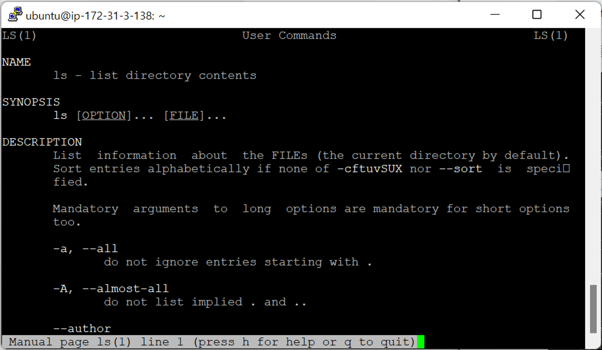

- [리눅스 기본 명령어](#리눅스-기본-명령어)
  - [도움말 사용법](#도움말-사용법)
    - [`man` (manual)](#man-manual)

# 리눅스 기본 명령어

## 도움말 사용법

### `man` (manual)

- `man (명령어)` : 각종 명령어의 사용법을 알려줌 (도움말)
  
  
  - `space bar` : 다음 페이지로 이동
  - `q` : 탈출
