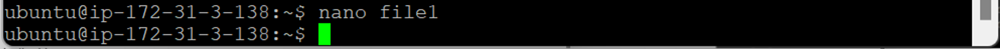
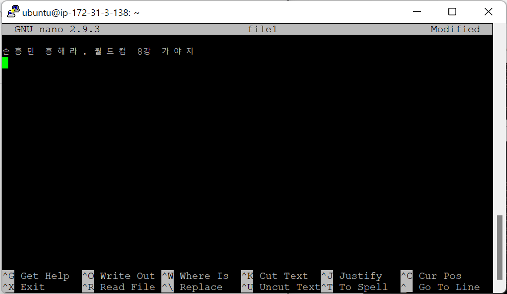

- [리눅스 기본 명령어](#리눅스-기본-명령어)
  - [nano 에디터](#nano-에디터)
    - [`nano`](#nano)

# 리눅스 기본 명령어

## nano 에디터

- **vi 에디터**
  - 유닉스의 디폴트
  - 윈도우 나오기 전부터 만들어짐
  - 명령어를 다 알고 있어야 함 → 초보자가 사용하기에는 어려움 (익숙해지면 편함)
    - 들어가기 : `vi (file_name)`
    - 종료: `Shift` → `ZZ`
    - 저장 : `:wq`

### `nano`

- `nano (file_name)` : vi 에디터 대체용 편집기 (일반 사용자)
  
  
  - word처럼 사용 가능
  - 명령어 메뉴
    - 저장 : `Ctrl + O` → Enter
    - 빠져나옴 : `Ctrl + X` → Enter
  - 요즘에는 디폴트로 깔려있음
