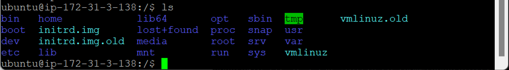
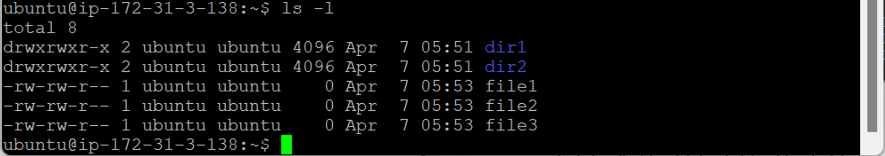
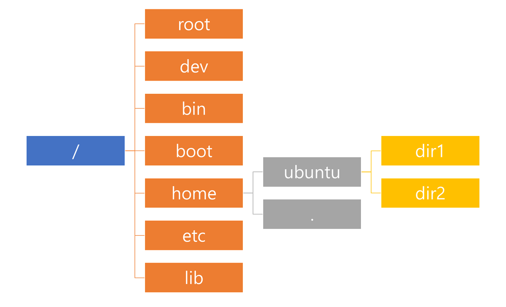

- [리눅스 명령어](#리눅스-명령어)
  - [리눅스 우분투 디렉터리 구조](#리눅스-우분투-디렉터리-구조)
    - [주요 디렉터리 기능](#주요-디렉터리-기능)

# 리눅스 명령어

## 리눅스 우분투 디렉터리 구조

- 설치하는 순간 자동으로 `/` (루트 디렉터리) 안에 여러 디렉터리 생성 → 기능별로 분류
  
  
  

### 주요 디렉터리 기능

- `etc` (et cetera) : 시스템 설정 관리 파일
- `bin` (binary) : 실행 명령 파일
- `dev` (device) : 장치 파일 (프린터, 모니터 등 장치 제어)
- `home` : 사용자 홈 디렉터리가 생성되는 곳
- `lib` (library) : 시스템 라이브러리
