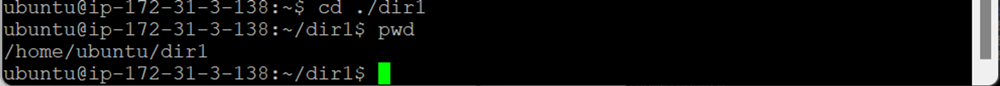
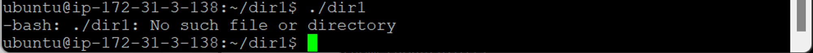
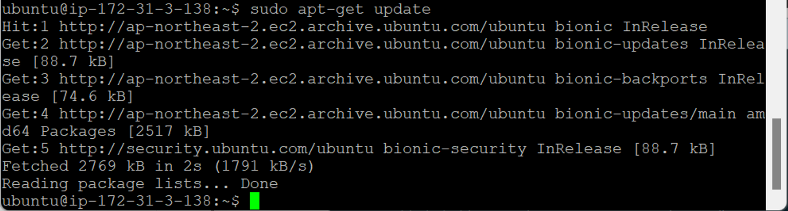

- [리눅스 명령어](#리눅스-명령어)
  - [리눅스 명령어](#리눅스-명령어-1)
    - [`cd` (change directory)](#cd-change-directory)
    - [`sudo` (superuser do)](#sudo-superuser-do)
    - [`apt-get`](#apt-get)
    - [`passwd`](#passwd)
    - [`su` (**switch** user)](#su-switch-user)
    - [`who`](#who)
    - [`exit`](#exit)
    - [`cat`](#cat)

# 리눅스 명령어

## 리눅스 명령어

### `cd` (change directory)

- `cd ../` : 한 단계 위로 이동
  
- `cd` : 홈 디렉터리로 이동
  
- 홈 디렉터리에서 `dir`으로 이동
  - **상대 경로** : 내 위치를 기준으로 경로 표시
    - `cd ./(dir_name)`
      
      - `.` : 현재 위치
      - `./(dir_name)` : 현재 위치 아래에 있는 `dir`
      - 기준에 따라 경로 달라져야 함
        
    - `cd ~/(dir_name)`
      
      - `~` : 홈 디렉터리
      - `~/(dir_name)` : 홈 디렉터리 아래에 있는 `dir`
    - `cd (dir_name)` (실제 사용)
      
      - 내 위치의 하위로 들어갈 때 `./` 생략해도 무관
  - **절대 경로** : 풀네임
    - `cd /home/ubuntu/(dir_name)`
      
      - 기준이 바뀌어도 경로가 바뀌지 않음
- `cd /` : 루트 디렉터리로 이동
  

### `sudo` (superuser do)

- 일반 사용자가 일회성으로 잠시 root 권한으로 작업할 수 있음
- 명령어 라인에 한해서만 일시적으로 권한 부여
- root 암호 알려주기 부담스러울 때 유용
  - etc, lib 등 삭제 가능 → 우분투 망가질 수 있음

### `apt-get`

- 서버에서 특정 기능을 가진 패키지 다운로드
- 업그레이드나 패치 필요할 때

  - 윈도우 : 유료 → 자동
  - 우분투 : 무료 (오픈소스) → 패키지가 올라가 있는 서버에서 다운로드

- `apt-get install (pakage_name)` : 다운과 동시에 설치
  
  - `Permission denied` : 권한이 없음
  - 시스템 자체에 추가되기 때문에 root 유저만 가능
- `sudo apt-get install (pakage_name)` : root 유저 권한으로 다운과 동시에 설치
  
  - `sl` : 기차 그림을 화면에 띄워주는 패키지
    
- `sudo apt-get update`
  
  - 우분투 패키지가 저장되어 있는 서버에 접속해서 추가할 것들 리스트업
    - 접속 서버 추가 or 변경 → 업데이트 필요 (최신 버전으로 자동 수정됨)
    - 리눅스 우분투 → 파일 시스템
      - 파일에 모든 게 설정되어있고 스크립트 되어 있음
    - `cd /etc/apt/sources.list` : `apt-get` 접속해야 할 주소 정보 → 다운로드, 설치
      - root 유저는 주소 수정, 삭제 가능 → `sudo` 쓰는 이유

### `passwd`

- 사용자 비밀번호 지정하거나 변경
- AWS EC2 우분투 root 계정 막혀있는 것 OPEN
  - `sudo passwd root` : root 패스워드 생성 신청 → root 유저 사용하려는 것 인식
    
    - root에 관한 명령어 → `sudo` 사용
    - 비밀번호 2회 물어봄 (new, retype)
    - 키보드 입력 시 커서 안 움직임
    - 백스페이스로 지울 수 X → 명령어 입력부터 다시 시작해야 함

### `su` (**switch** user)

- 일시적으로 계정 변환 → `sudo`와 다름
- `su - (user_name)` : `root` 권한으로 들어갈 수 있는지 확인
  
  - 비밀번호 입력 필요
  - 프롬프트 `#`으로 변경됨
- **예제**
  - `pwd`
    
    - root의 홈 디렉터리 : `root`
  - `cd /home/ubuntu` : root에서 ubuntu로 위치 이동 (절대 경로)
    
    
  - `touch (file_name)` : 빈 껍데기 파일 생성
    
    - 파일 소유권 : root → root 계정으로 파일 생성

### `who`

- 로그인한 유저가 누군지 물어봄
  
  - 현재 `root`여도 들어온 것은 `ubuntu`임

### `exit`

- 원래 유저로 다시 복귀
  

### `cat`

- `cat (file_name)` : 파일 내용을 화면에 출력
  
- `cat (file_name1) > (file_name2)` : `file1`의 내용을 `file2`에 출력 (덮어쓰기 → 원래 내용 손실 O)
  
- `cat (file_name1) >> (file_name2)` : `file1`의 내용을 `file2`의 내용 뒷부분에 추가 (원래 내용 손실 X)
  
