- [리눅스 명령어](#리눅스-명령어)
  - [파일+디렉터리 소유\&허가권](#파일디렉터리-소유허가권)
    - [`chmod` (change mode)](#chmod-change-mode)
    - [`chown` (change owner)](#chown-change-owner)
    - [`chgrp` (change group)](#chgrp-change-group)

# 리눅스 명령어

## 파일+디렉터리 소유&허가권

- **예제**

  - nano 에디터로 `rfile1`에 라인 추가
    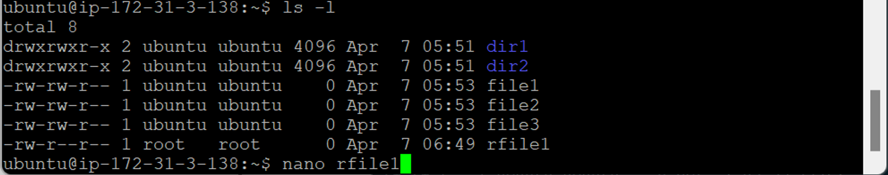
    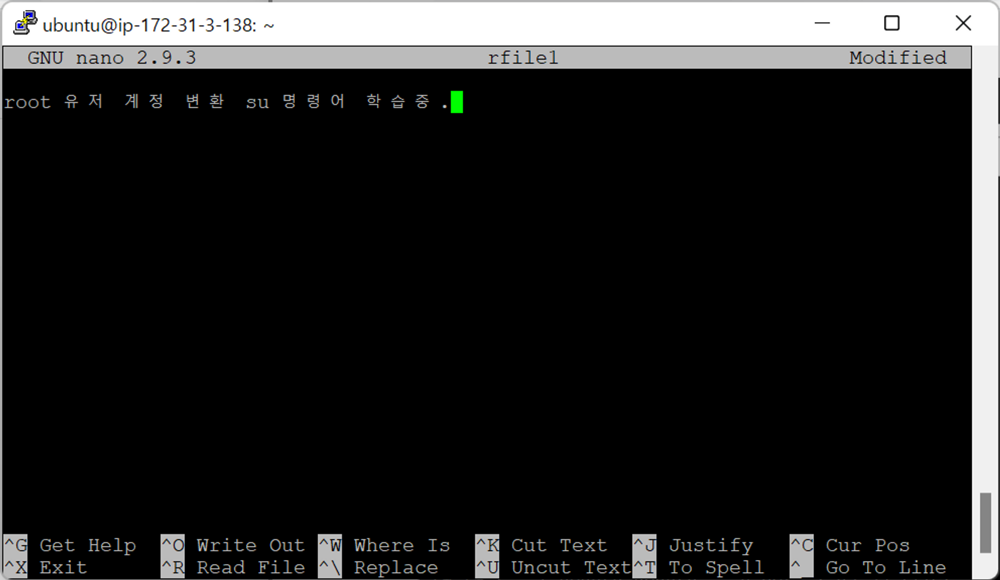
  - `ctrl + O` : write out
    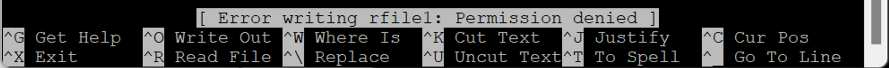
    - `Permission denied` : 권한이 없음
    - 파일 소유권 : `root` → `ubuntu`가 수정, 추가 불가
  - `ctrl + X` : exit
    

- 리눅스 → 여러 人 동시에 접속 가능한 OS
- **파일 권한**

  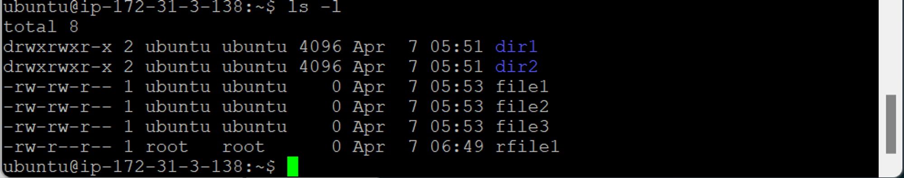

  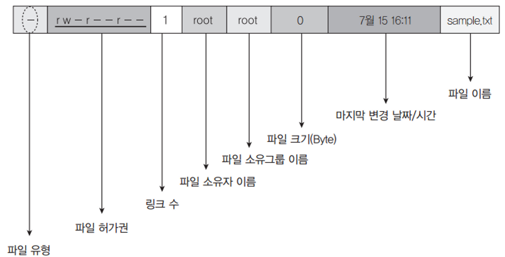

  - 계정 로그인 → 유저 이름과 똑같은 이름의 그룹이 생김 (디폴트)

  - **맨 앞자리 제외 3개씩 끊어읽음**
    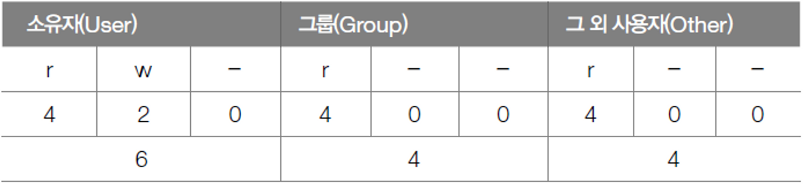
    - `r` (read) : 읽기
    - `w` (write): 쓰기 → 생성, 삭제
    - `x` (execute): 실행
    - `-` : 권한 없음

### `chmod` (change mode)

- 파일 or 디렉터리에 설정된 접근 권한 변경

- **이진 표기법** (낯설지만 한 번에 가능)
  

  - 예제

    - `rwx` $= 2^2+2^1+2^0=4+2+1=7$
    - `r-x` $= 2^2+0+2^0=4+0+1=5$
    - `rw-` $= 2^2+2^1+0=4+2+0=6$
    - `rw- r-- r--` → `rwx rwx rw-` : `chmod 776 (file_name)`

  - `chmod (ugo) (file_name)`

    - 파일 소유자 : root
      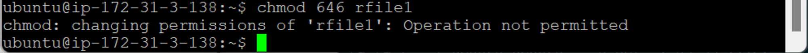
      - `ubuntu`가 `root` 소유 파일 권한을 변경하려고 하기 때문에 안 됨
    - 파일 소유자 : ubuntu
      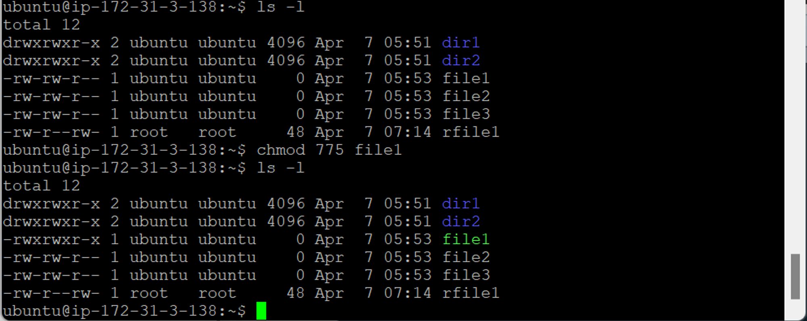
      - `sudo` 없이 권한 변경 가능

  - `sudo chmod (ugo) (file_name)`
    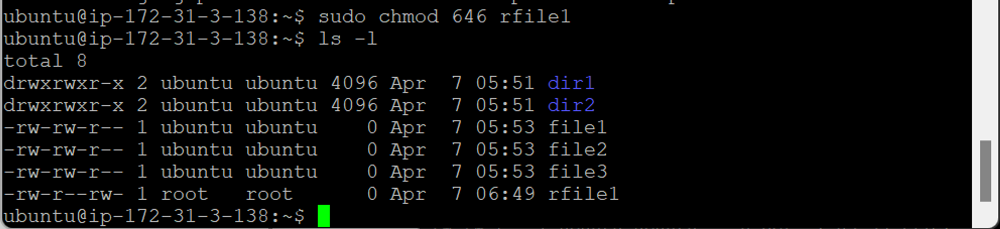

    - `rw- r-- r--` → `rw- r-- rw-` 권한 변경

    - nano 에디터로 `rfile1`에 라인 추가
      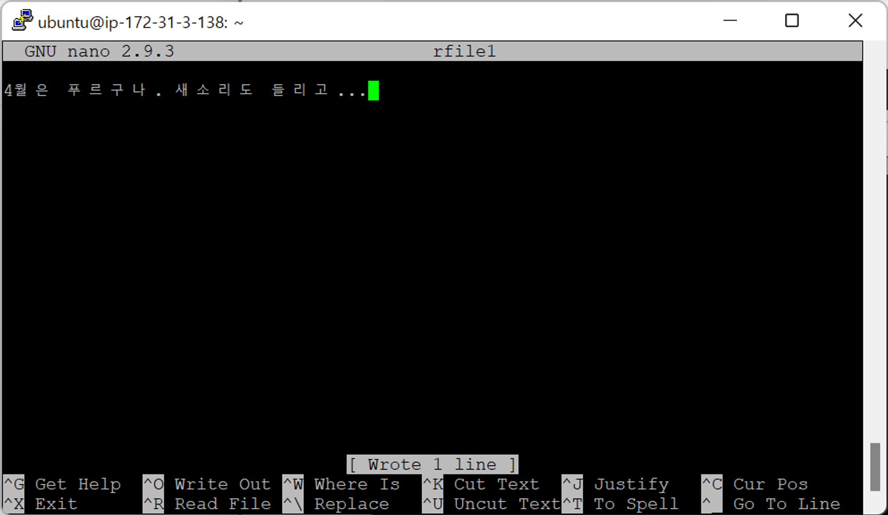
      - write out (`ctrl + O`) 가능

- **문자 표기법** (한 번에 안되지만 쉬움)

  - 각 권한별 `+`, `-`로 표기
  - **예제**

    - `rwx rwx rwx` → `r-x rwx rwx` : `chmod u-w (file_name)`
    - group에 `r` 권한 제거 : `chmod g-r (file_name)`
    - other에 `x` 권한 추가 : `chmod o+x (file_name)`

  - `chmod a+x (file_name)` : user, group, other (all)에 `x` 권한 추가
    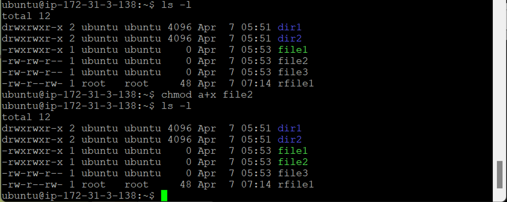
    - `rw- rw- r--` → `rwx rwx r-x` 권한 변경
    - 이진 표기법 `chmod 775 (file_name)`와 동일

### `chown` (change owner)

- root 소유면 `sudo` 사용해야 함
- `chown (owner) (file_name)` : 파일 소유자 변경
  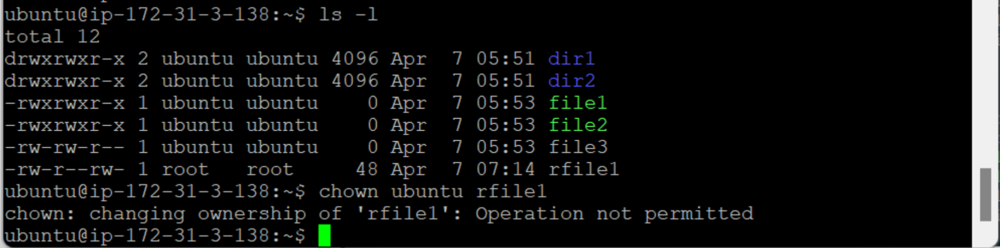
  - 아직 ubuntu 소유가 아니므로 `sudo` 사용해야 함
- `sudo chown (group_name) (file_name)`
  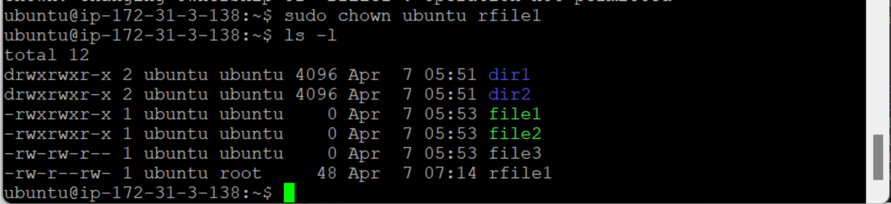
  - ubuntu 소유로 바뀜

### `chgrp` (change group)

- 그룹 변경
  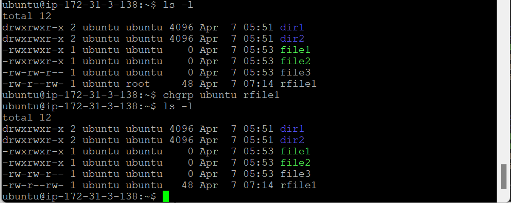
  - 소유자가 ubuntu이기 때문에 `sudo` 사용 안 해도 됨
