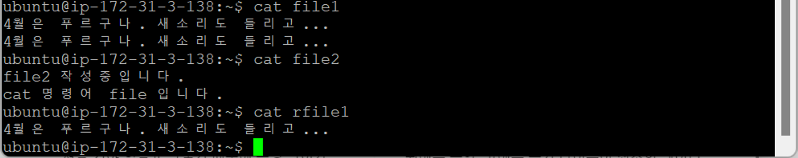
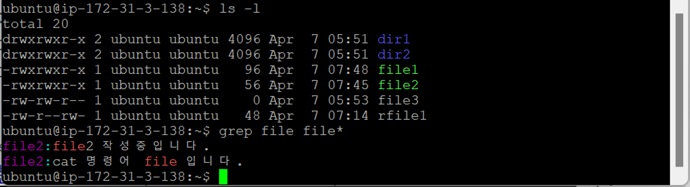
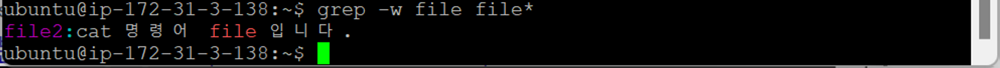

- [리눅스 명령어](#리눅스-명령어)
  - [리눅스 중요 명령어](#리눅스-중요-명령어)
    - [`grep`](#grep)

# 리눅스 명령어

## 리눅스 중요 명령어

### `grep`

- 파일 찾기 (검색)
  
  - 일일이 검색하기는 힘듦
- `grep file (word)*` : 특정 단어로 시작하는 파일 찾기
  
- `grep -w file (word)*` : 정확한 단어가 들어가 있는 파일 찾기
  
  - 단어 뒤에 다른 문자 붙어있으면 검색 X
