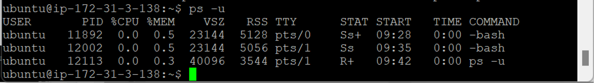

- [리눅스 중요 명령어](#리눅스-중요-명령어)
  - [리눅스 중요 명령어](#리눅스-중요-명령어-1)
    - [`grep`](#grep)
    - [`find`](#find)
    - [`ps`](#ps)

# 리눅스 중요 명령어

## 리눅스 중요 명령어

### `grep`

- `grep (word) (file_name)` : 파일에서 특정 패턴 문자열 찾기
  
  
  - 현재 위치에 있는 파일 검색
  - 대소문자 구분 O
- `-i` : 대소문자 무시
  - `grep -i (word) (file_name)`
    
- `-v` : 매칭되는 패턴이 존재하지 않는 라인 선택
  - `grep -v (word) (file_name)` : 매칭되는 패턴이 존재하지 않는 라인 선택
    
- `-w` : 단어 단위로 매칭
  - `grep -w (word) (file_name)`
    
- `-n` : 검색 결과 출력 라인 앞에 라인 번호 출력
  - `grep -n (word) (file_name)`
    
- `-l` : 패턴이 존재하는 파일 이름만 표시
  - `grep -l (word) (file_name)`
    
- `-c` : 파일 당 패턴이 일치하는 라인 개수 출력

  - `grep -c (word) (file_name)`
    

- `grep -nw (word) (file_name)` : 단어 정확히 검색 + 라인 확인
  
- `grep [char](word) (file_name)` : 검색 단어 앞에 특정 문자만 허용
  
  - `[]` (대괄호) 안에 포함된 문자 중 1개와 매치
- `grep [^(char)](word) (file_name)` : 특정 문자
  
  - `[]` (대괄호) 안의 `^` 뒤에 포함된 문자들 제외
- `grep [star_char-end_char](word) (file_name)` : 검색 단어 앞에 특정 문자만 허용
  
  - `[]` (대괄호) 안에 `-`를 이용해 연속적인 문자 범위 지정
- `grep -r (word) /(dir_name)/*` : 하위 디렉터리까지 검색
  
  
- `grep bash /etc/passwd`
  
  - root 유저 접속 → `/bin/bash`
  - ubuntu 유저 접속 → `/home/ubuntu:/bin/bash`
  - 리눅스 : 쉘 프로그램
    - 사용자 $\xrightarrow[]{명령}$ 쉘 $\xrightarrow[]{해석}$ 커널 $\xrightarrow[]{명령\ 수행\ 후\ 결과\ 전송}$ 쉘 $\xrightarrow[]{해석}$ 사용자

### `find`

- 파일명 → 특정 파일 검색
- 파일이 있는 위치 경로 출력
- = Windosw : 찾기

- `find . -name '(file_name)*'`
  
  - `.` : 내 위치
  - 내가 작업하는 위치에서 특정 단어로 시작하는 모든 파일 경로 검색
- `find . -name '(file_name)*' -ls` : 파일 정보 자세히
  
- `find / -name '(file_name)*'`
  
  - `/` : 루트 디렉터리
  - 최상위 디렉터리부터 하위까지 특정 단어로 시작하는 파일 경로 검색
- `find /(dir)/ -name '(file_name)*'`
  
  - 특정 디렉터리부터 하위까지 특정 단어로 시작하는 파일 경로 찾기

### `ps`

- 현재 실행 중인 프로세스 목록 출력 (모니터링)
  
  - `PID` : 프로세스 아이디
  - `TTY` : 터미널 번호 (개수만큼 나옴)
  - `TIME` : 시간
  - `CMD` : 실행 명령어
    - `bash` 쉘 : 우분투가 살아 있는 한 항상 실행 → 명령어 처리
- `ps -e` : 실행 중인 모든 프로세스 정보 출력
  
  
  - 백그라운드에서 돌고 있는 모든 명령어
  - 루트 유저에서 돌고 있는 것도
- `ps -f` : 프로세스 정보 자세히
  
  - `ls -l`와 비슷
  - `PID` : 프로세스 번호
  - `PPID` : 부모 프로세스 번호
    - 특정 프로세스 부하 → 종료
      - 부모(상위) 프로세스 실행 중 → 종료 X
      - 부모 프로세스 종료 필요
- `ps -ef` : 모든 프로세스 자세히 출력 (대부분 사용)

  

  

  - `UID` : 유저 아이디
  - `PID` : 프로세스 아이디
    - `init` : 초기 파일 (우분투의 모든 `PID` 1번)
  - `PPID` : 부모 프로세스 아이디

- `ps -u` : 특정 사용자에 대한 모든 프로세스 정보
  
