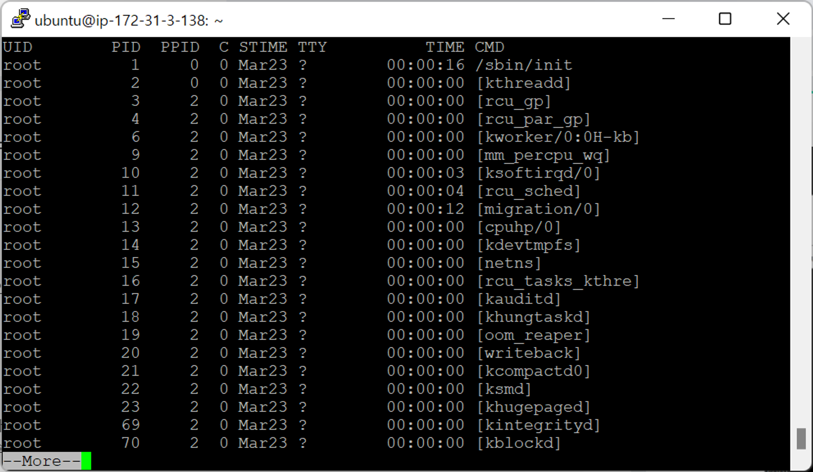
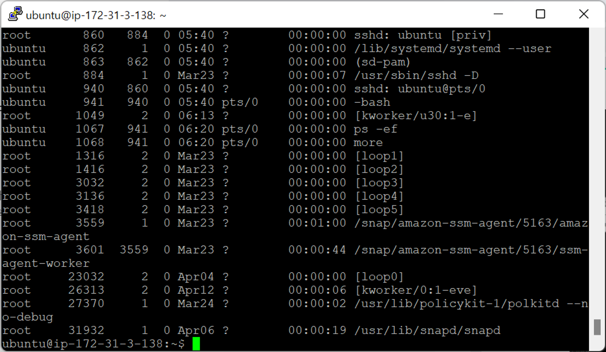
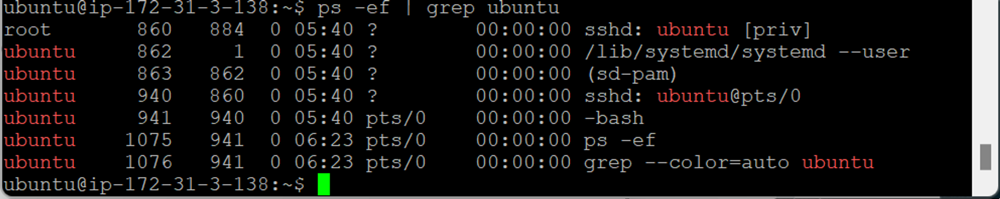

- [리눅스 중요 명령어](#리눅스-중요-명령어)
  - [명령어 연결자](#명령어-연결자)
    - [`|` (파이프 라인)](#-파이프-라인)

# 리눅스 중요 명령어

## 명령어 연결자

### `|` (파이프 라인)

- `ps -ef | more` : 한 페이지 단위로 출력
  
  
  
  - `space` → 다음 페이지로 이동
- `ps -ef | grep (word)`
  
  - 모든 프로세스 중 특정 단어가 포함된 라인 출력 (多 사용)
