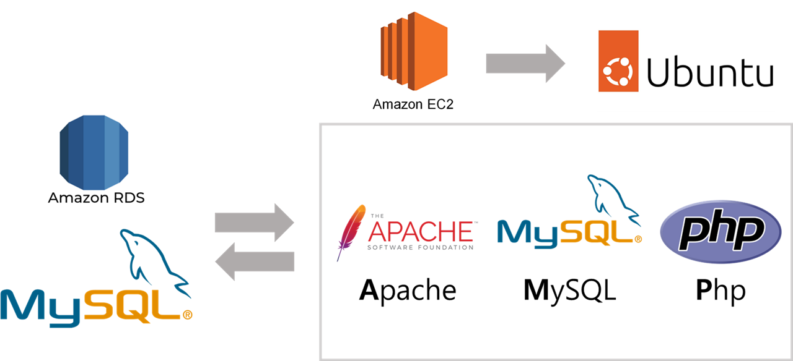
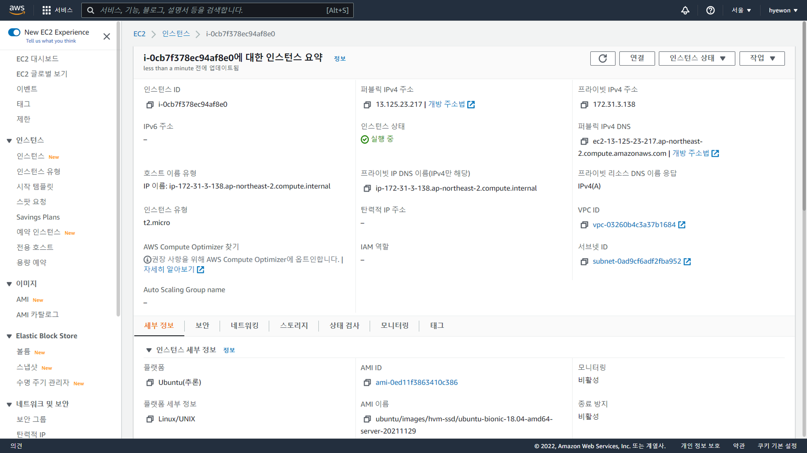
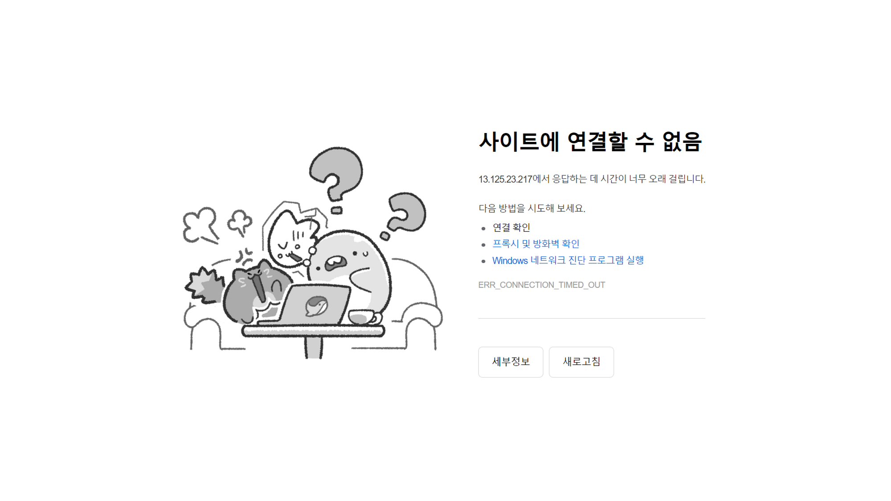
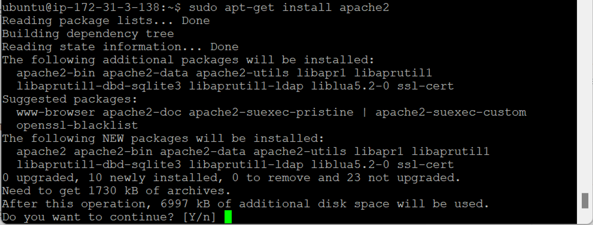
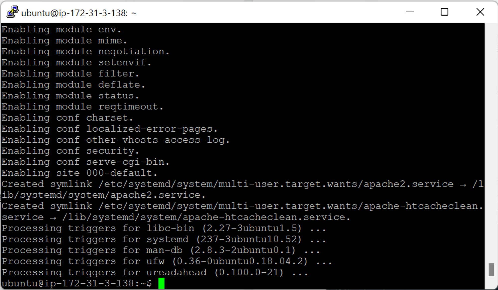
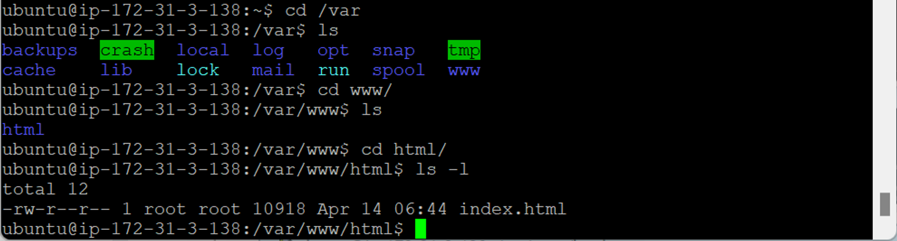

- [RDS생성+php 연동-1](#rds생성php-연동-1)
  - [서버 IP](#서버-ip)
  - [Apache](#apache)

# RDS생성+php 연동-1

> AWS EC2 서비스를 통해 우분투 인스턴스 생성 → 우분투 서버 돌아감
>
> 우분투 서버에 웹 엔진만 달면 우분투 서버 IP 입력 시 페이지 띄울 수 있음 → WAS 구축
>
> - WAS 구축 시 AMP 솔루션 (**A**pache, **M**ySQL, **P**hp)이 가장 기본적임
> - MySQL AWS RDS로 따로 연동 (프리티어) → 우분투에 직접 설치 X
>
> ---
>
> - 네비게이터 (익스플로러, 크롬) 이용
> - 모바일, PC방, 집, 학교 등 어디서나 가능
> - tukorea.ac.kr → 도메인 매칭 (IP가 아닌 도메인으로 접속 가능)

## 서버 IP

- EC2 → 인스턴스
  
  - **퍼블릭 IPv4 주소** : 외부에서 접속해서 들어갈 수 있는 고정 IP 주소 (서버 주소)
- 퍼블릭 IPv4 주소 접속
  
  - 웹 엔진 설치 X → 접속 X

## Apache

- `sudo apt-get install apache2` : Apache 패키지가 있는 서버에서 다운 및 설치 (무료)
  
  
  - 웹에서 http를 통해 html 문서를 전송해주는 웹 엔진 설치
- IP 주소 입력 시 http → 자동으로 `/var/www/html/index.html` 찾음 (디폴트 시작 위치)
  
  - Apache 설치 시 `www` 디렉터리 생성됨
  - 설정 파일 수정 시 시작 위치 변경 가능
