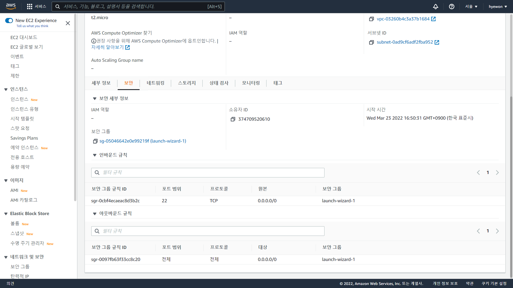
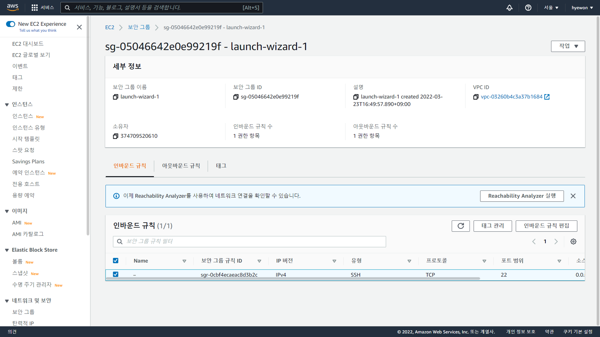
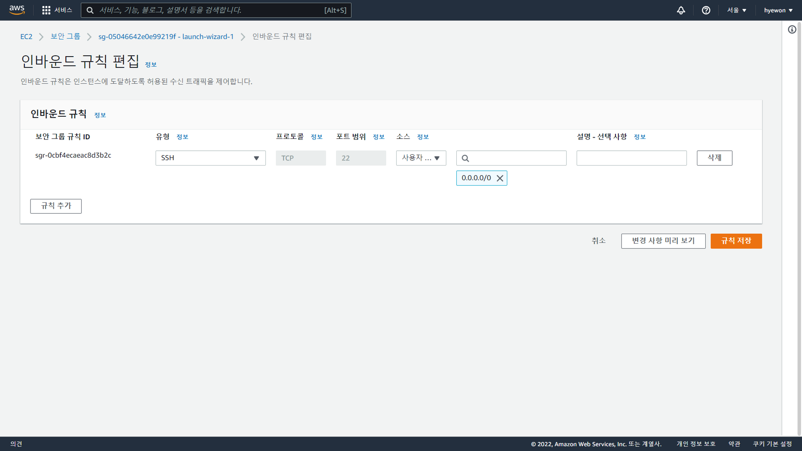
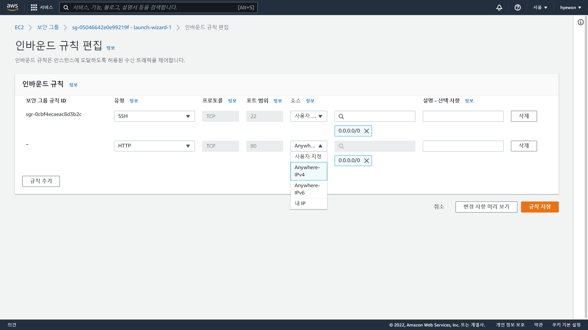
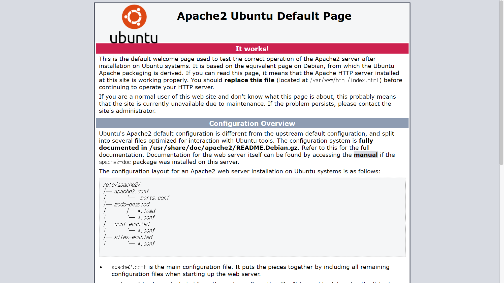

- [RDS생성+php 연동-1](#rds생성php-연동-1)
  - [HTTP 80포트 열기](#http-80포트-열기)

# RDS생성+php 연동-1

## HTTP 80포트 열기

> http 프로토콜 : 웹에서 인터넷(서버)에 접근할 때 80포트 이용

- 인스턴스 → 보안 → 보안 그룹
  
- 인바운드 규칙 → 인바운드 규칙 편집
  
- 인바운드 규칙
  
  - PuTTY → SSH 22 포트만 열려있음
- 규칙 추가 → HTTP 선택 (80 포트)
  
  - `Anywhere-IPv4` : 웹 브라우저는 어디서 접근하든지 다 받아줘야 함
- 퍼블릭 IPv4 주소 접속 → Apache 초기 화면
  
