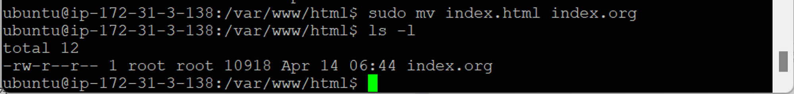
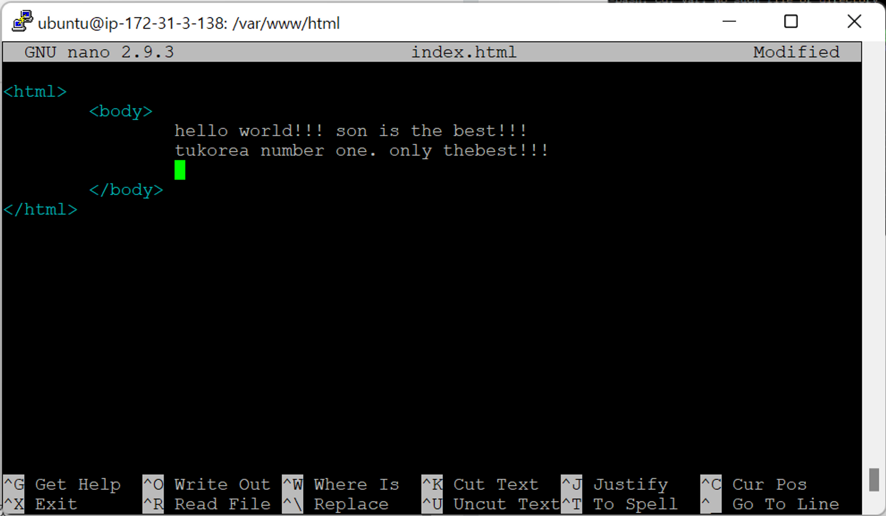
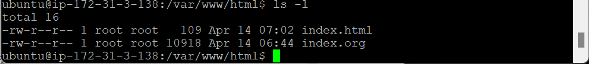

- [RDS생성+php 연동-1](#rds생성php-연동-1)
  - [HTML](#html)

# RDS생성+php 연동-1

## HTML

- `sudo mv index.html index.org`

  

  - root 소유이므로 `sudo` 사용
  - `index.html` 내용 수정하기 위해 이름 변경 (나중에 복구할 수 있도록)

- `index.html` 접속 → 다른 이름으로 변경했기 때문에 못 불러옴
  
- `sudo nano index.html`
  
  
  - 아파치 설치했기 때문에 html 인식
  - 아파치 설치 X → html 인식 X
- `index.html` 접속 → 작성 내용 확인 가능
  
  
  - html : 화면 예쁘게 만드는데 한계 (홈페이지 만드는데 역부족)
