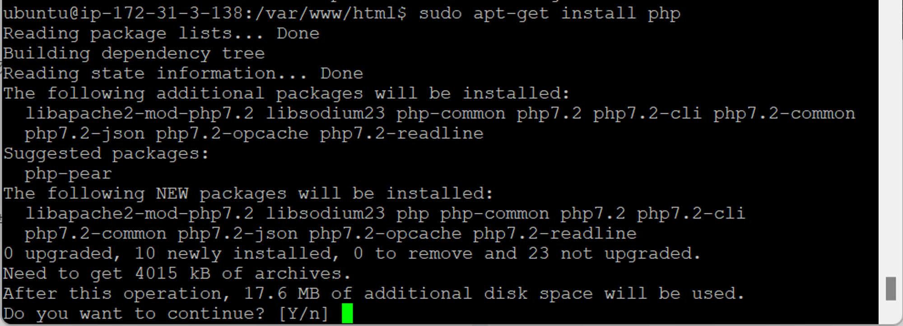
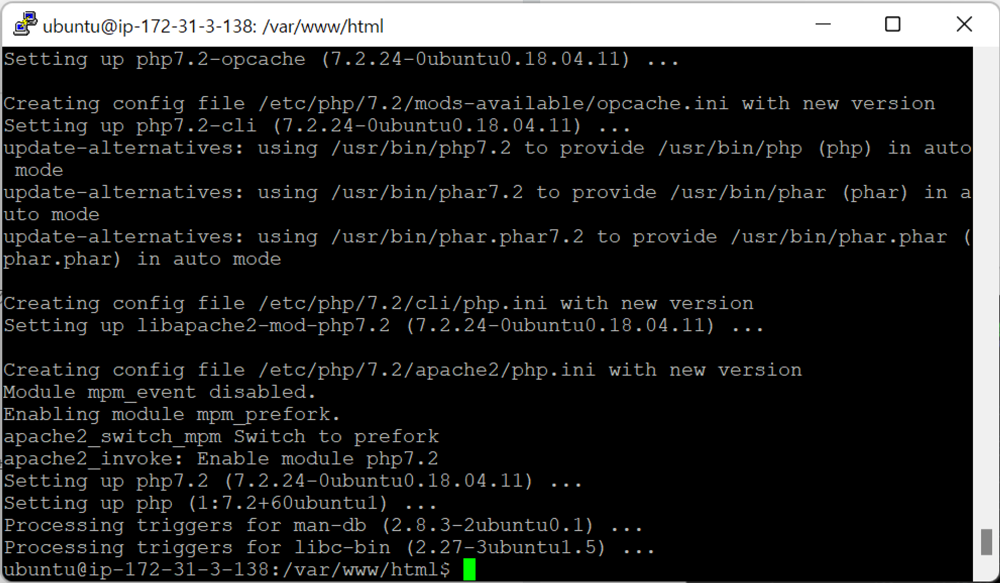
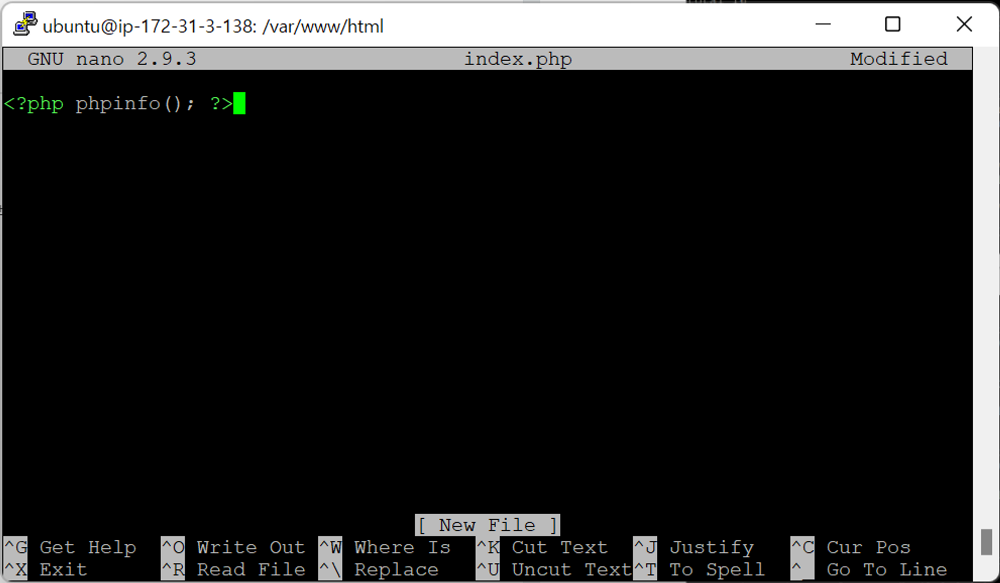
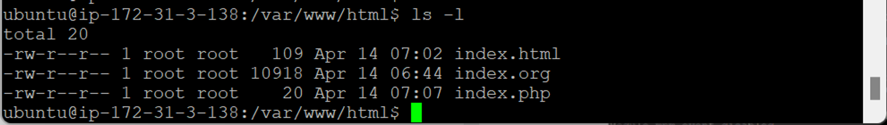
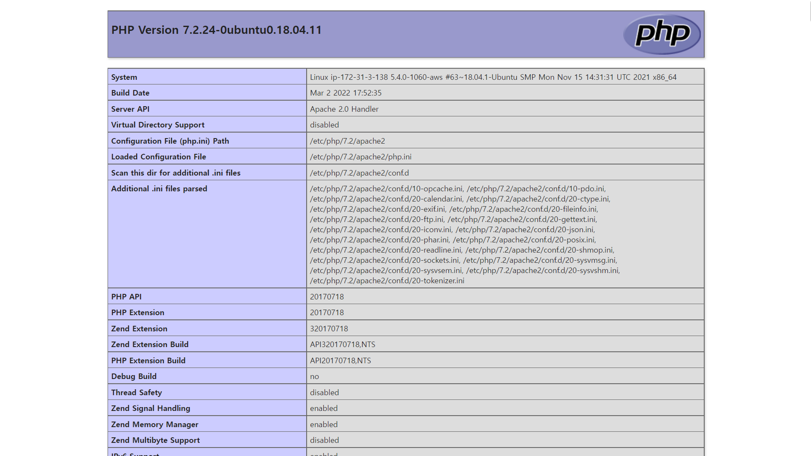

- [RDS생성+php 연동-1](#rds생성php-연동-1)
  - [PHP](#php)

# RDS생성+php 연동-1

## PHP

- `sudo apt-get install php` : php 설치
  
  
- `sudo nano index.php` : php 파일 생성 → 웹서버 (WAS)에서 동작
  
  
  - 확장명 php → php 인식, 작동
  - `phpinfo()` : php 함수 매뉴얼 화면
- `index.php` 접속 → php 문법 적용
  
  
