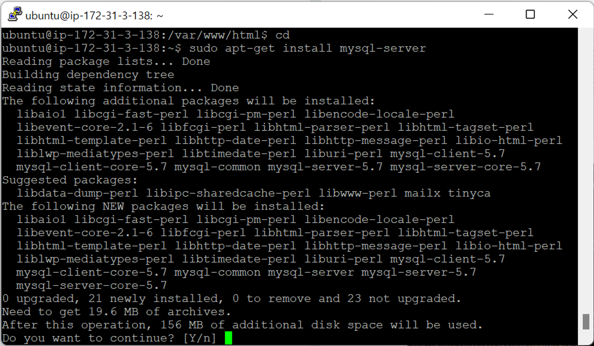
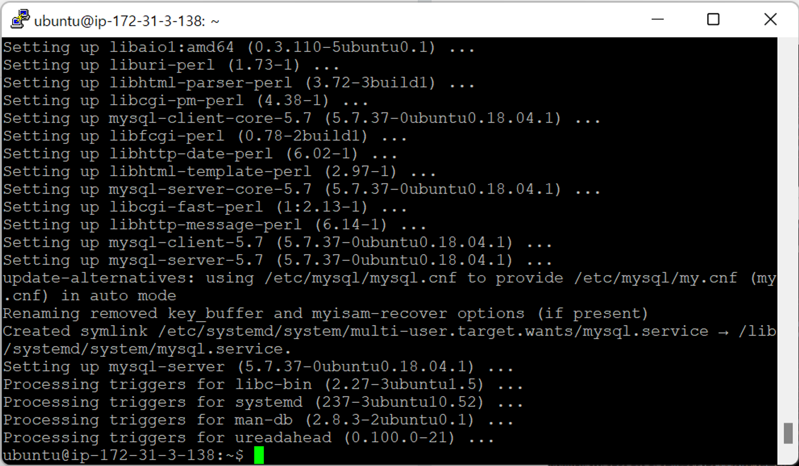
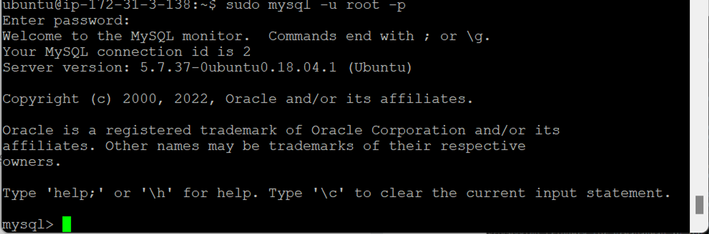
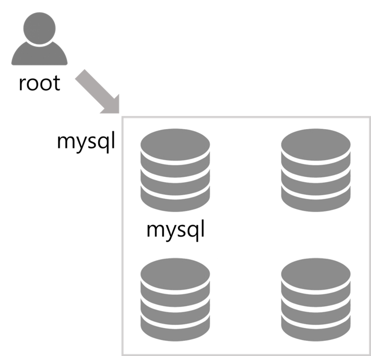
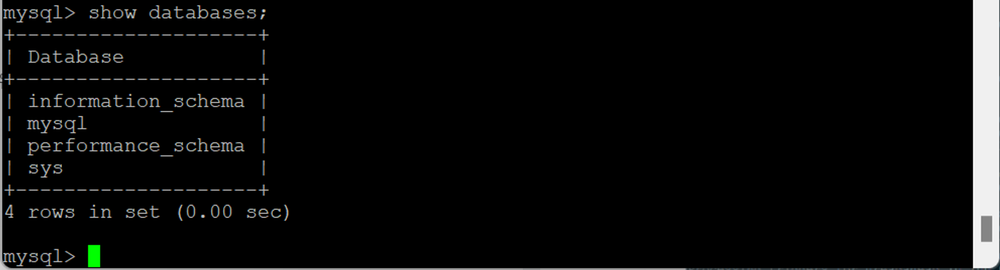
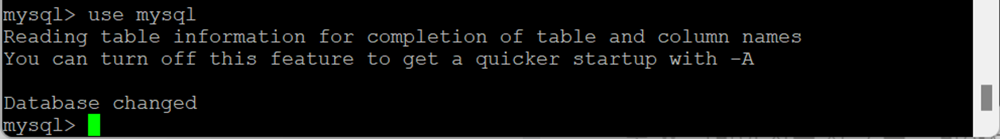
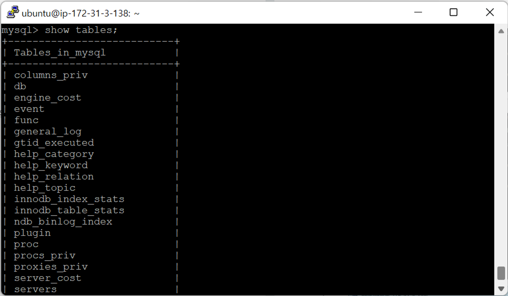
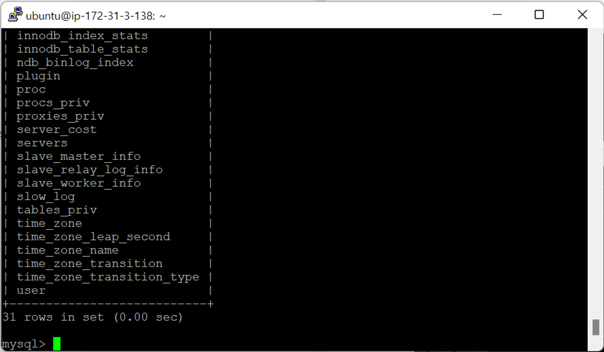
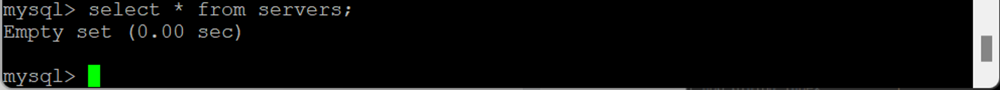
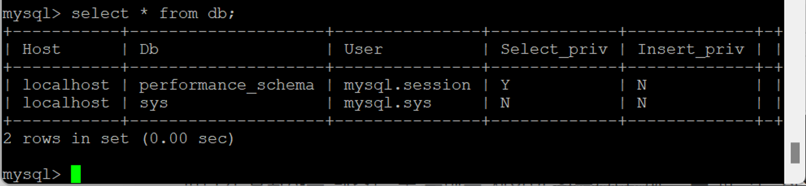

- [RDS생성+php 연동-1](#rds생성php-연동-1)
  - [MySQL](#mysql)

# RDS생성+php 연동-1

## MySQL

- `sudo apt-get install mysql-server` : 우분투에 직접 MySQL 설치
  
  
  - 내 서버(PC)에 붙였기 때문에 IP, 도메인 넣을 필요 X
- `sudo mysql -u root -p` : MySQL 접속
  
  - 내 서버이기 때문에 바로 접속 가능
  - `sudo` : ubuntu로 들어왔기 때문에 필요
  - `mysql` : MySQL 접속 명령어
  - `-u` : 유저 지정 (root → 디폴트로 생성)
  - `-p` : 비밀번호 만들지 않았기 때문에 Enter치면 물어봄 (커서 안 움직임)
    
- `show databases;` : DB 조회 (`;` 주의)
  
  - MySQL에 디폴트로 생성된 DB (메타 데이터 + 테스트 DB)
  - SQL Developer : 커넥트할 때 들어갈 DB 선택
  - 터미널 모드 : 단계별로 들어감
- `use mysql` : `mysql` DB에 접속 (DB 이름 선택)
  
  - 다른 DB → 메타 데이터라 건들면 X
- `show tables;` : 테이블 조회
  
  
- `select * from servers;` : `servers` 테이블의 데이터 조회
  
  - 데이터 없음
- `select * from db;` : `db` 테이블의 데이터 조회
  
