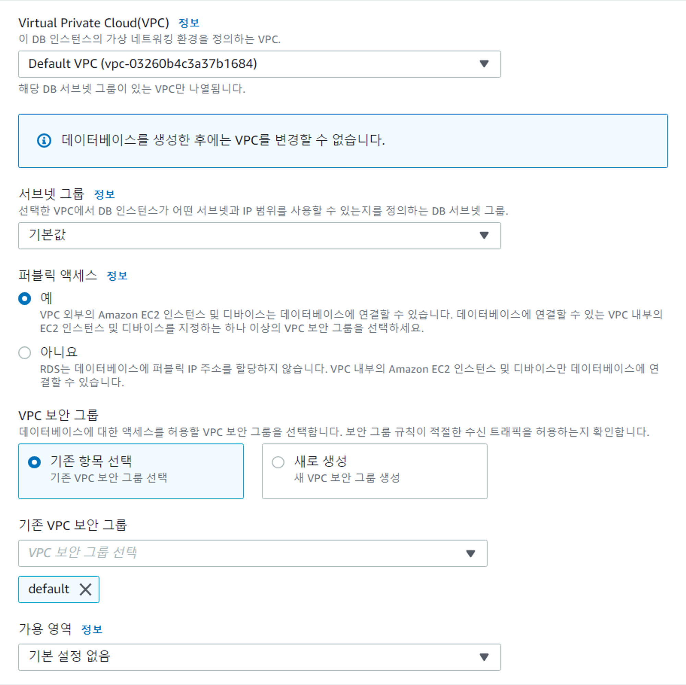

- [RDS생성+php 연동-2](#rds생성php-연동-2)
  - [RDS DB 생성](#rds-db-생성)

# RDS생성+php 연동-2

> EC2 우분투 → Apache + php
>
> - MySQL : DB 서버 외부에 따로 구축 (프리티어)
>   - AWS에서 DB 서버 구축할 수 있는 인스턴스 선택 → RDS (Relational Database Service)
> - php : 원격으로 데이터 저장하고, 저장한 데이터 불러오는 웹페이지

## RDS DB 생성

- AWS → RDS → 데이터베이스 생성
  
- **데이터베이스 생성 방식 선택**

  

  - **표준 생성** : 하나하나 옵션 선택
  - 손쉬운 생성 : 디폴트로 선택되는 것으로 생성 (옵션 따로 선택 X)

- **엔진 옵션** : DB 종류 선택
  
  - Amazon Aurora : 아마존에서 제공
  - Oracle : 세계 점유율 1위
  - Microsoft SQL Server (MSSQL) : 세계 점유율 2위
  - **MySQL**, MariaDB : 오픈소스 (무료)
- **템플릿**
  
  - 기업에서 사용할 만큼 용량 제공 X
- **설정**
  
  - **DB 인스턴스 식별자** : MySQL에 생성할 DB 서버 이름
    
  - **마스터 사용자** : 막강한 권한을 가진 유저
    - = 우분투 root 유저 : 막강한 힘 → 뭐든지 할 수 있음 (디폴트로 생성)
  - **마스터 암호** : DB 만들고 접속할 때 비밀번호 입력
- **인스턴스 구성**
  
  - 프리티어 적용 → 자동으로 `t3.micro` 설정
- **스토리지**
  
  - 20GB 디폴트로 할당
- **가용성 및 내구성**
  
  - **다중 AZ** : 데이터 보안 → 여러 리전에 분산해서 사용 (프리티어 허용 X)
- **연결**

  

  - **퍼블릭 액세스** : 우분투 서버에서 다른 사람도 원격으로 DB 서버에 접속 가능

- **추가 구성**
  

  - 자동 백업 활성화 : 특정 주기로 자동 백업
    - 클라우드가 아니라 직접 DB 구축 시 직접 백업 필요

  

  - MySQL 자동 업그레이드

- **월별 추정 요금**
  
- 데이터베이스 생성

  

- DB 생성 완료
  
  - DB 서버 : 컴퓨팅 생성 → 주소 존재
    - 엔드포인트 = 도메인 주소
  - 웹 서버 WAS 형태 → IP 주소
