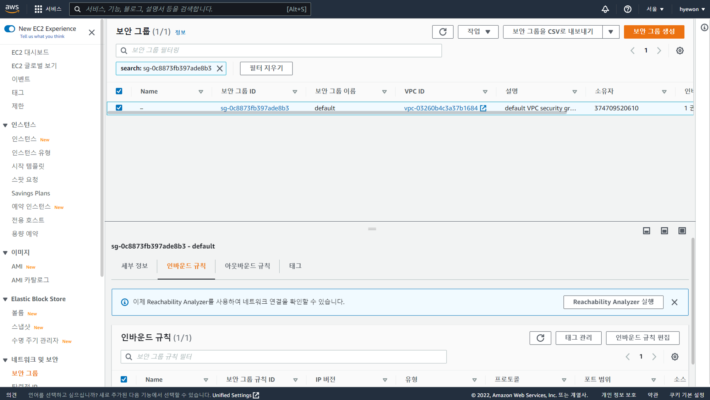
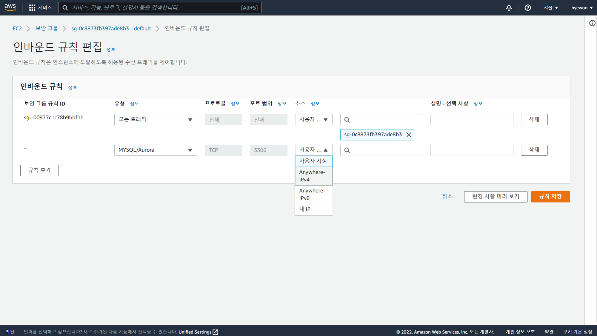

- [RDS생성+php 연동-2](#rds생성php-연동-2)
  - [MySQL 3306 포트 열기](#mysql-3306-포트-열기)

# RDS생성+php 연동-2

## MySQL 3306 포트 열기

> 우분투 → 접속 가능한 여러 통신 프로토콜 존재
>
> 원격으로 데이터 교환하기 위해 포트 열어야 함 → 누구나 와서 접근 가능
>
> - PuTTY : 22 포트
> - HTTP : 80 포트
> - MySQL : 3306 포트

- VPC 보안 그룹 → 인바운드 규칙 → 인바운드 규칙 편집
  
- 인바운드 규칙 편집 → 규칙 저장
  
  - `MYSQL/Aurora` 선택 시 자동으로 3306 포트 열림
  - `Anywhere-IPv4` → 0.0.0.0/0 (v4 규칙)
  - 외부에서 DB 서버 붙일 수 있음
