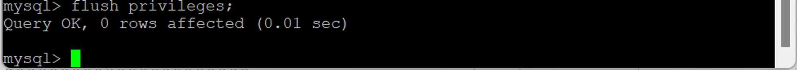

- [RDS생성+php 연동-2](#rds생성php-연동-2)
  - [MySQL](#mysql)
    - [root 유저](#root-유저)
    - [일반 유저](#일반-유저)

# RDS생성+php 연동-2

## MySQL

### root 유저

- `mysql -u root -p -h (endpoint)` : MySQL 원격으로 접속
  
  - `-u root` : RDS DB 생성 시 생성한 root 유저로 접속 (마스터 사용자)
  - `-p` : 비밀번호 입력
  - `-h (endpoint)` : 호스트 (주소) 입력
    ⇒ 인바운드 규칙에서 3306 포트 열어뒀기 때문에 접속 가능
- `show databases;` : DB 조회
  
  - 메타 데이터 (데이터 딕셔너리)
    - MySQL 구축 시 특정 작업 안 해도 DB 생성
    - MySQL이 작동하는데 필요한 기본 데이터
    - `sys` 데이터 건드리면 안 됨
      - root 유저는 삭제 가능 → 유저 생성 필요
  - 우분투 처음 생성 → 아무것도 안 해도 여러 디렉터리 생성
    - 우분투 운영 시 필요한 여러 시스템 관리 (etc, home, lib 등)

1. `create database (db_name);` : DB 생성 (`;` 주의)

   

2. `create user '(user_name)'@'%' identified by '(password)';` : 신규 유저 생성 (`''` 주의)

   

   - `@'%'` : 유저가 어느 위치에 있든지 무조건 접근할 수 있도록 권한 부여 (어디서 접근하든지)
     - `@'(location)'` : 유저가 특정 위치에서만 접근 가능
   - `'(password)'` : 비밀번호 생성

3. `grant all privileges on (db_name).* to '(user_name)'@'%';` : DB 접근 권한을 유저에게 부여

   

   - `all` : 모든 명령어에 대한 권한 부여
     - `select`, `create` 등 지정 가능
   - `(db_name).*` : DB 안의 모든 것에 접근할 수 있다는 표시 (권한 가짐)
     - 테이블, 뷰, 함수 등

   ⇒ 신규 유저가 어디든지 접근할 수 있는 권한 생성

- `show databases;` : DB 조회
  
  - 새로 생성한 DB 조회 가능
- `flush privileges;` : 완전히 반영 (복수형 `s` 주의)
  
  - 신규 유저 → 새로 생성한 DB에 접속해서 작업 가능
- `exit` : MySQL 나감
  

### 일반 유저

- `mysql -u (user_name) -p -h (endpoint)` : 일반 유저로 MySQL 접속
  
- `show databases;`
  
  - 일반 유저가 볼 수 있는 DB 조회
    - 일부 메타데이터 + 내가 생성한 DB
- `use (db_name)` : 작업할 DB에 접속
  
- `show tables;` : 테이블 조회
  
  - 작업한 게 없어서 아무것도 안 나옴
