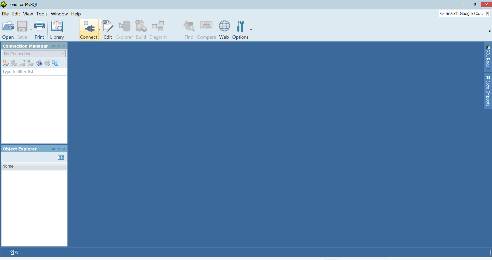
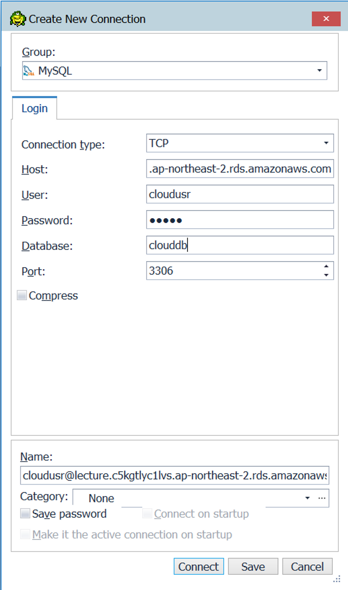
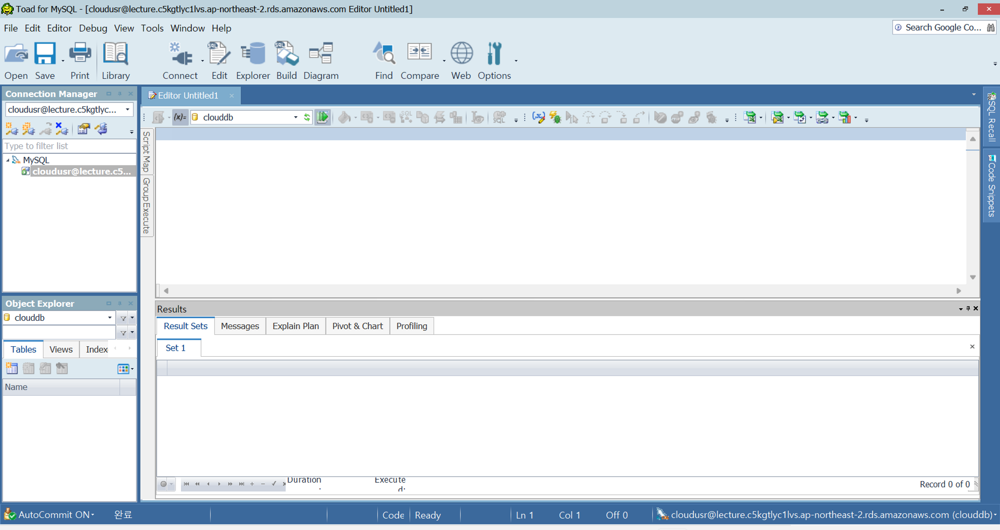
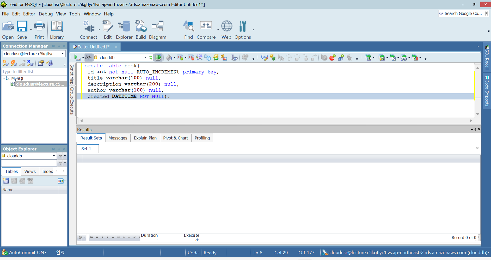
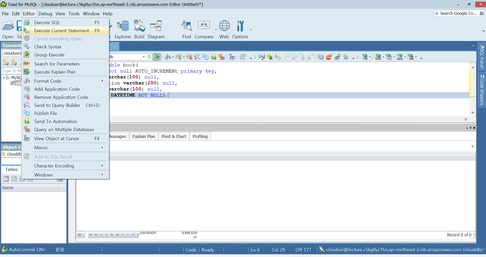
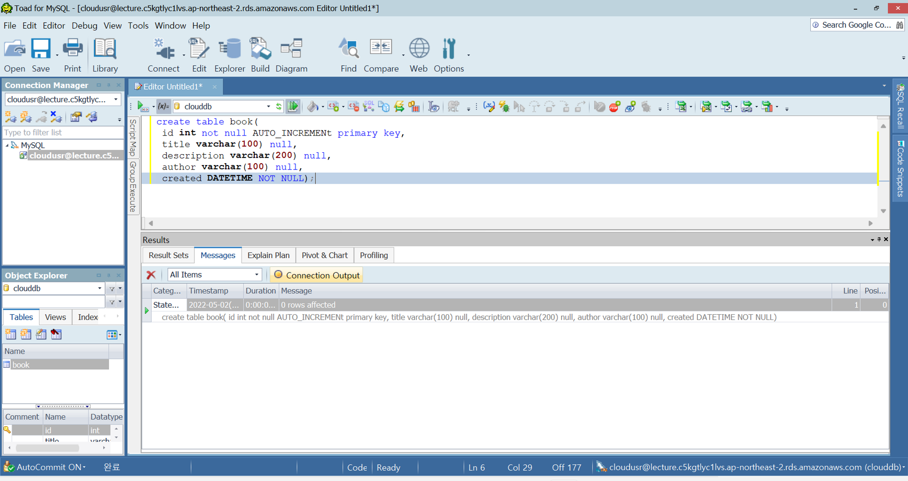
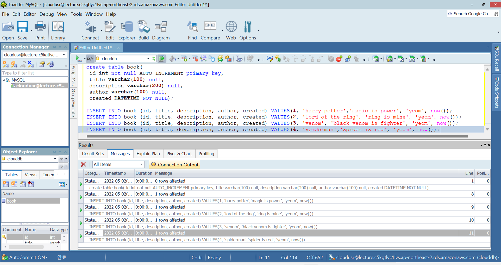
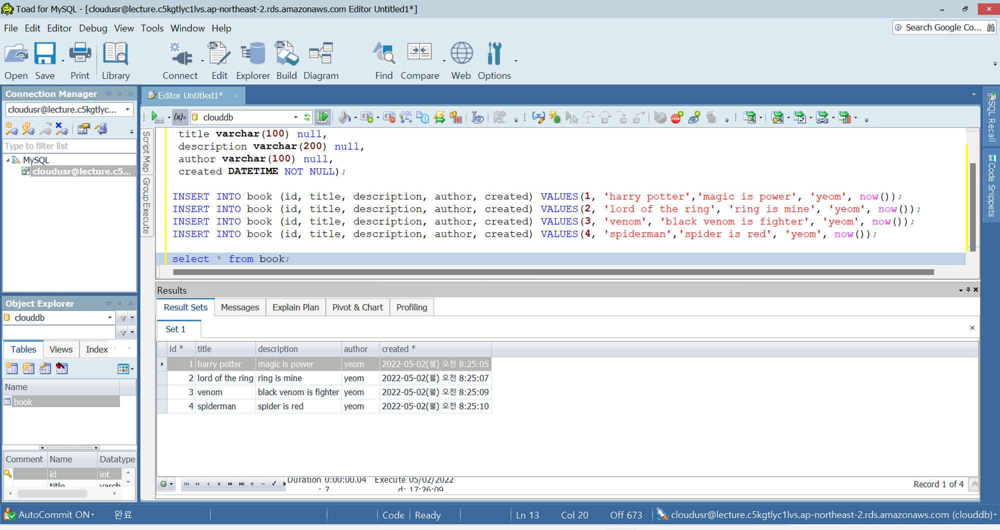

- [RDS생성+php 연동-2](#rds생성php-연동-2)
  - [TOAD](#toad)

# RDS생성+php 연동-2

## TOAD

> 터미널 모드 → 불편 (전 라인 작업 고칠 수 X)
>
> 에뮬레이터 → 편함
>
> - GUI 환경 → DB 접속, 쿼리 입력 등
> - 1번 세팅 → 불러오기 (매번 입력 X)
>
> ---
>
> - Oracle SQL Developer, MySQL Workbench 등
> - TOAD (80~90% 사용)

- Connect

  

- Toad for MySQL
  
  - Host : 엔드포인트
  - 들어가자마자 접속할 유저, DB 입력
- Edit 창 → 훨씬 작업하기 좋은 환경
  
- `create table` : 테이블 생성
  
  - `AUTO_INCREMENT primary key` : 기본키에 자동으로 일련 번호 부여
- 쿼리문 실행
  

  - `F5` : 에디터 창에 있는 문장 다 실행
  - `F9` : 커서가 깜빡이는 라인만 실행 (한 문장씩)

  - 쿼리문 성공
    
    - Tables → book 생성
    - 한 번 더 실행 시 오류

- `INSERT` : 데이터 입력
  
  - 한 번 더 실행 시 오류
- `select` : 데이터 조회
  
