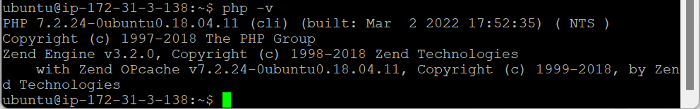
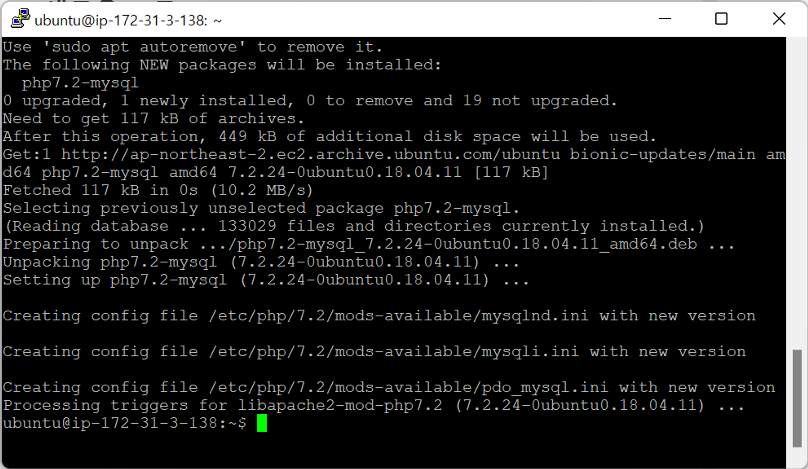
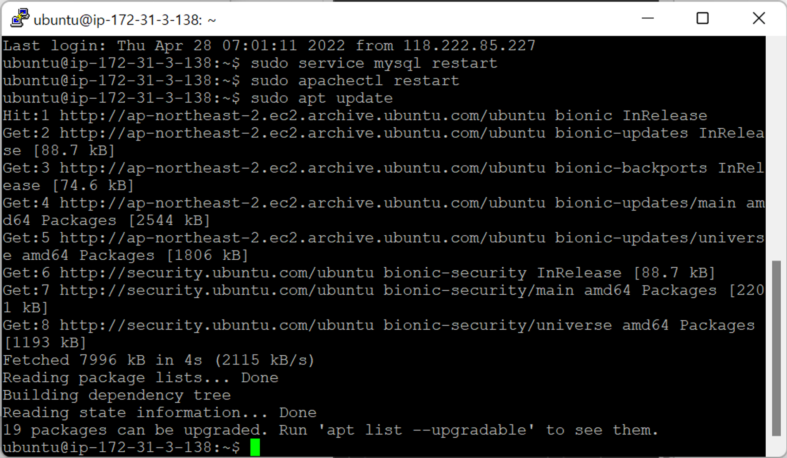
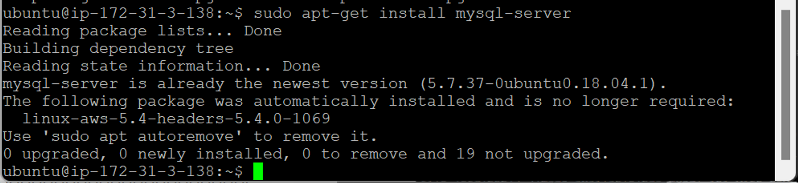
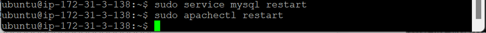
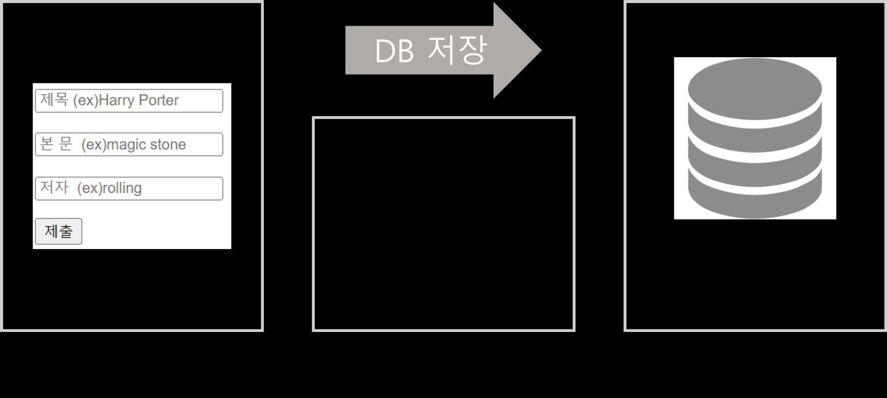
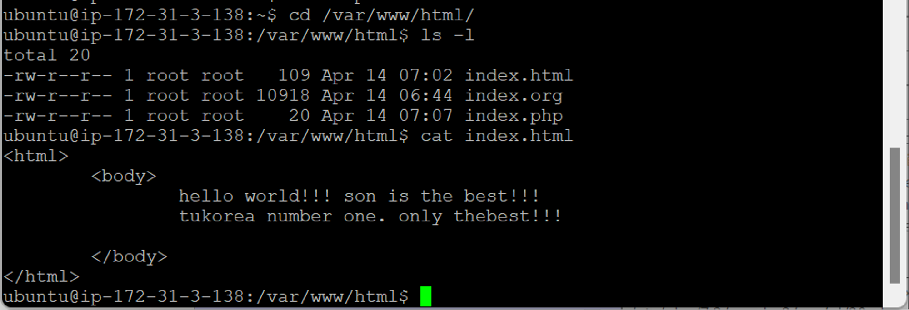
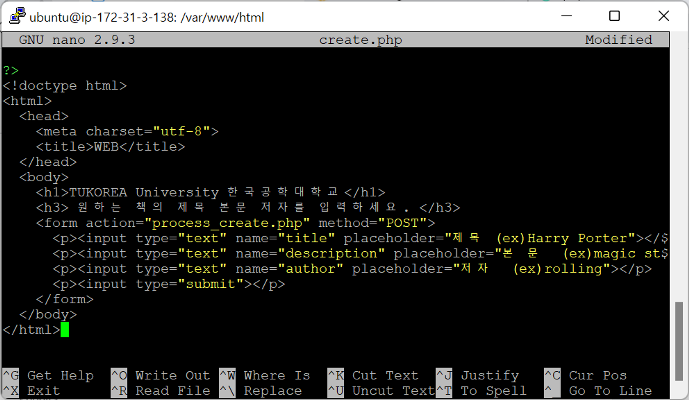
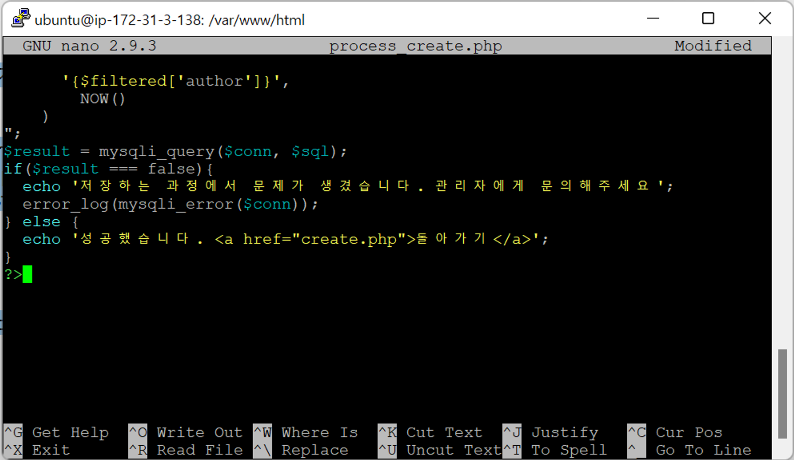
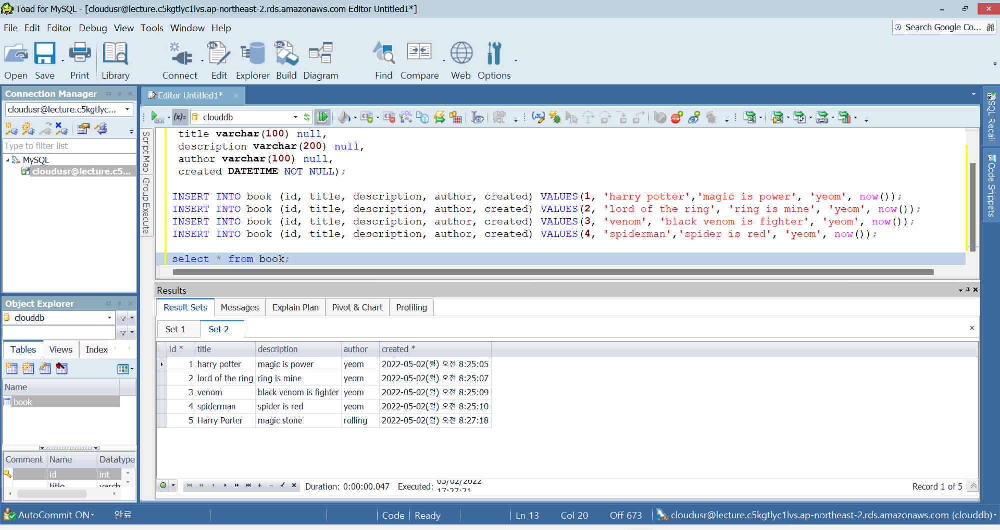

- [RDS생성+php 연동-2](#rds생성php-연동-2)
  - [PHP](#php)
    - [환경 설정](#환경-설정)
    - [웹페이지 생성](#웹페이지-생성)

# RDS생성+php 연동-2

## PHP

> 데이터 불러오고 저장하는 웹페이지 생성

### 환경 설정

- `php -v` : php 버전 확인
  
  - php와 설치할 패키지 버전 동일해야 함

1. `sudo apt install php7.2-mysql` : php에서 MySQL 적용되도록 만들어주는 패키지 설치

   

   

2. `sudo service mysql restart` : MySQL 재시작
3. `sudo apachectl restart` : Apache 재시작
4. `sudo apt update`

   

5. `sudo apt-get install mysql-server`

   

   - 우분투에 MySQL 컨트롤할 수 있는 MySQL 서버 + 클라이언트 설치

6. `sudo service mysql restart`
7. `sudo apachectl restart`

   

   - 웹페이지 띄워서 DB에 MySQL과 연결해서 DB에 저장할 수 있는 환경 세팅

### 웹페이지 생성



- `cd /var/www/html/` : `index.html` 저장 위치 (url 소스 찾아가는 기본 위치)

  

  - 웹페이지 IP 주소 입력 → 기본으로 접근
  - 반드시 `/var/www/html/` 위치!
    - 위치 변경 → 환경 변수 변경

- `sudo nano create.php` : DB 입력 가능한 화면 생성
  
  

  - 홈 디렉터리 아니므로 `sudo`로 들어감
  - `create.php`

    ```php
    <?php
    $conn = mysqli_connect(
      'lecture.c5kgtlyc1lvs.ap-northeast-2.rds.amazonaws.com', // 엔드포인트 (주소)
      'cloudusr', // 디비사용자명
      'cloud', // 비밀번호
      'clouddb'); // 데이터베이스 이름

    $sql = "SELECT * FROM book";
    $result = mysqli_query($conn, $sql);

    ?>
    <!doctype html>
    <html>
      <head>
        <meta charset="utf-8">
        <title>WEB</title>
      </head>
      <body>
        <h1>TUKOREA University 한국공학대학교</h1>
        <h3> 원하는 책의 제목 본문 저자를 입력하세요. </h3>
        <form action="process_create.php" method="POST">
          <p><input type="text" name="title" placeholder="제목 (ex)Harry Porter"></p>
          <p><input type="text" name="description" placeholder="본 문  (ex)magic stone"></p>
          <p><input type="text" name="author" placeholder="저자  (ex)rolling"></p>
          <p><input type="submit"></p>
        </form>
      </body>
    </html>
    ```

- `sudo nano process_create.php`
  
  

  - `process_create.php`

    ```php
    <?php
    $conn = mysqli_connect(
      'lecture.c5kgtlyc1lvs.ap-northeast-2.rds.amazonaws.com',
      'cloudusr',
      'cloud',
      'clouddb');
      # title, description 이라는 사용자가 입력한 정보를 그대로 php에 입력하는 행위는 보안에 취약, 따라서 관리 필요

      $filtered = array(
        'title'=>mysqli_real_escape_string($conn, $_POST['title']),
        'description'=>mysqli_real_escape_string($conn, $_POST['description']),
        'author'=>mysqli_real_escape_string($conn, $_POST['author'])
      );

    $sql = "
      INSERT INTO book
        (title, description, author, created)
        VALUES(
          '{$filtered['title']}',
          '{$filtered['description']}',
          '{$filtered['author']}',
            NOW()
        )
    ";
    $result = mysqli_query($conn, $sql);
    if($result === false){
      echo '저장하는 과정에서 문제가 생겼습니다. 관리자에게 문의해주세요';
      error_log(mysqli_error($conn));
    } else {
      echo '성공했습니다. <a href="create.php">돌아가기</a>';
    }
    ?>
    ```

- `create.php` 접속 → 데이터 입력 화면
  
  
- `process_create.php` → DB 저장
  
- `select` : 데이터 조회
  
