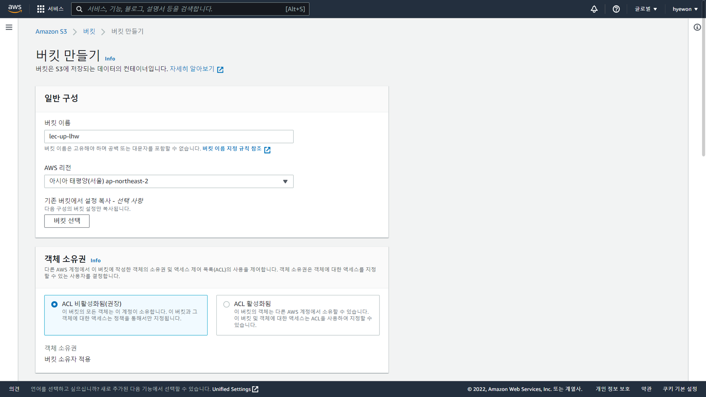
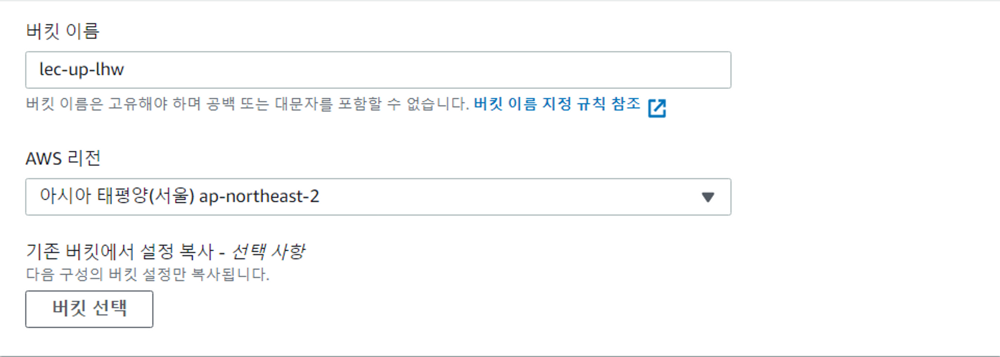
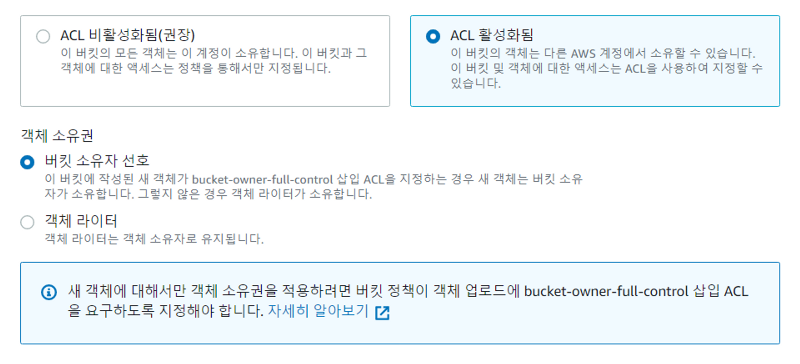
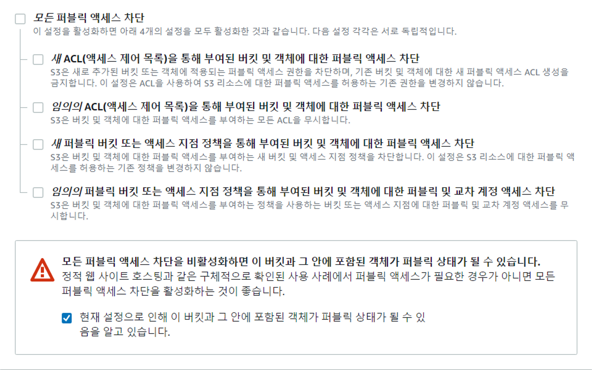
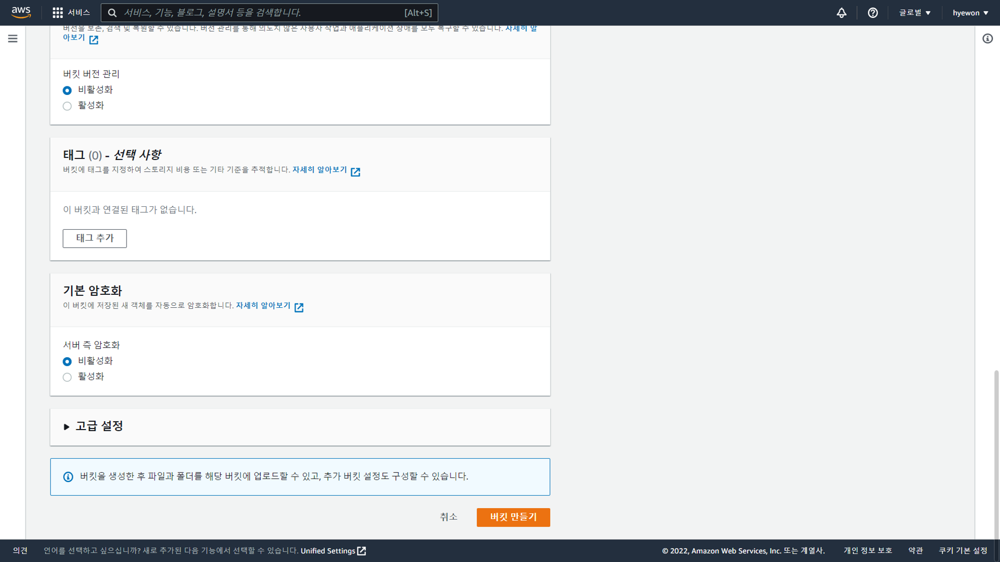
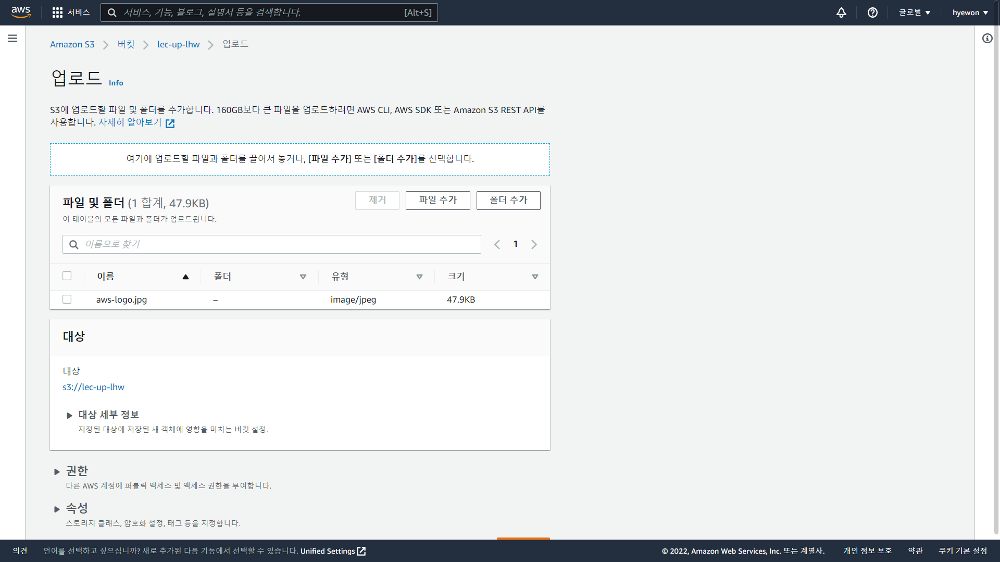
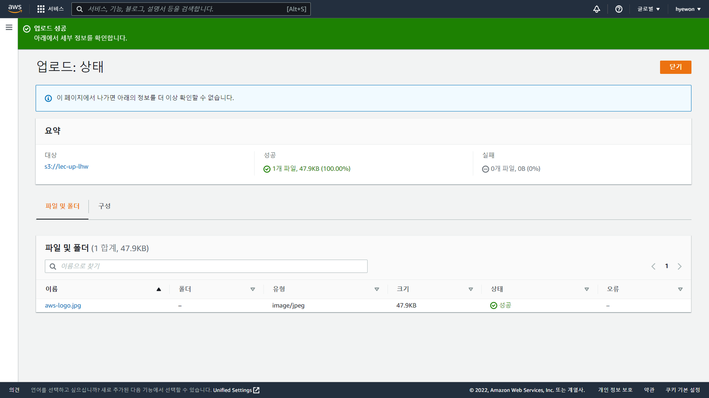

- [AWS S3 실습](#aws-s3-실습)
  - [버킷 만들기](#버킷-만들기)
  - [업로드](#업로드)

# AWS S3 실습

## 버킷 만들기

- 데이터 업로드, 관리, 다운로드 → 버킷 생성 필요
- S3 → 버킷 → 버킷 만들기
  
- **일반 구성**
  
  - `_` 불가
- **객체 소유권**
  
  - ACL 활성화 : 버킷 권한, 옵션 조정 가능
- **이 버킷의 퍼블릭 액세스 차단 설정**
  
- **버킷 버전 관리**
  
- **태그(0) - 선택 사항**
  
- **기본 암호화**
  
- 버킷 만들기
  

## 업로드

- S3 → 버킷 → 버킷 선택 → 업로드
  
  
