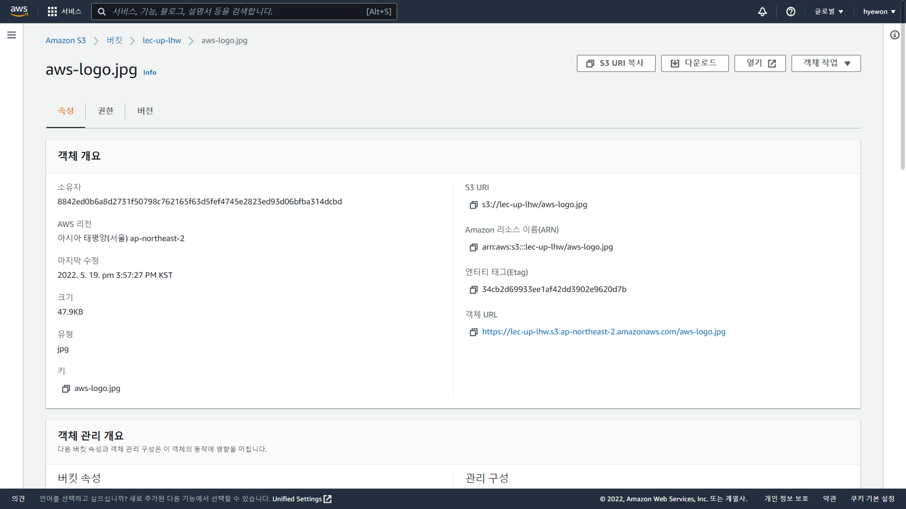
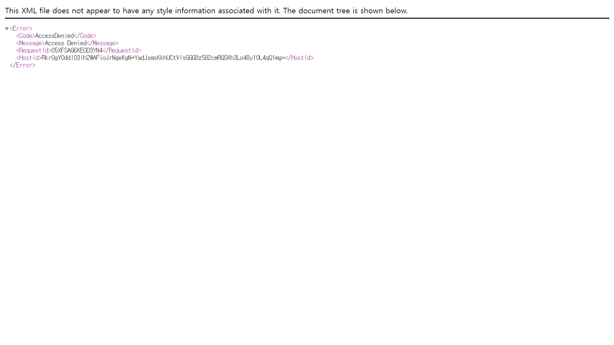
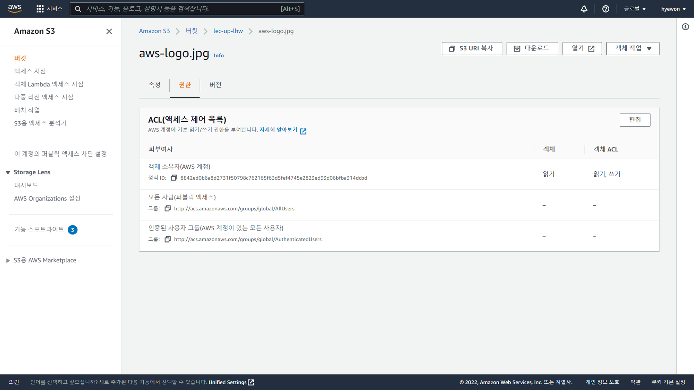
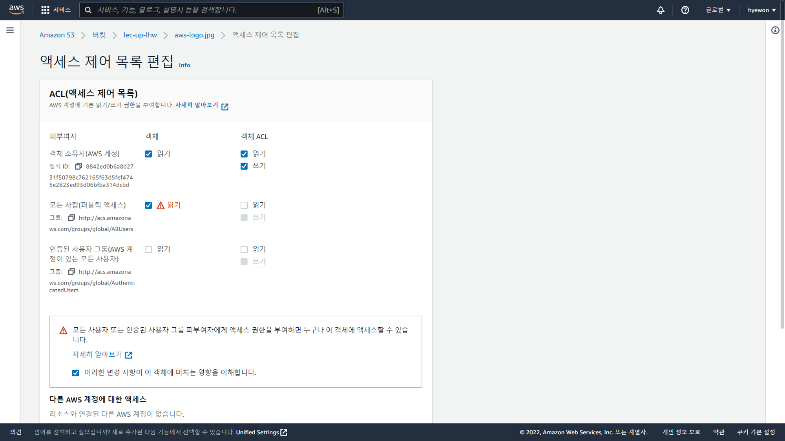
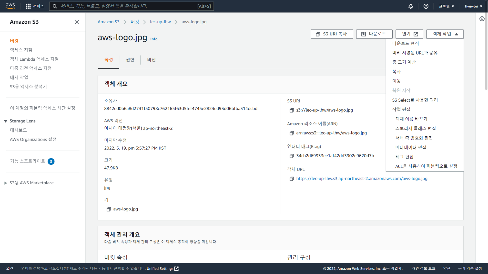

- [AWS S3 실습](#aws-s3-실습)
  - [객체](#객체)

# AWS S3 실습

## 객체

- 이미지 파일 선택
  
  - S3 : 데이터 주고받을 때 HTTP 프로토콜 사용
    - https://lec-up-lhw.s3.ap-northeast-2.amazonaws.com/aws-logo.jpg
    - 객체 조회, 다운로드 가능
- `AccessDenied`
  
  - 외부 사람은 볼 수 없게 세팅 → 객체 권한 조정
- 객체 권한
  
  - 버킷 만들기 - ACL 활성화 → 권한 편집 가능
  - 퍼블릭 액세스 : `-` `-` → 권한 없음
- 편집
  
  - 퍼블릭 엑세스 : 읽기
- URL 접속
  
  - 객체 조회, 다운로드 가능
- 객체 작업 편집
  
  - 객체 이름 변경, 서버 측 암호화 편집, 메타데이터 편집 등 가능
