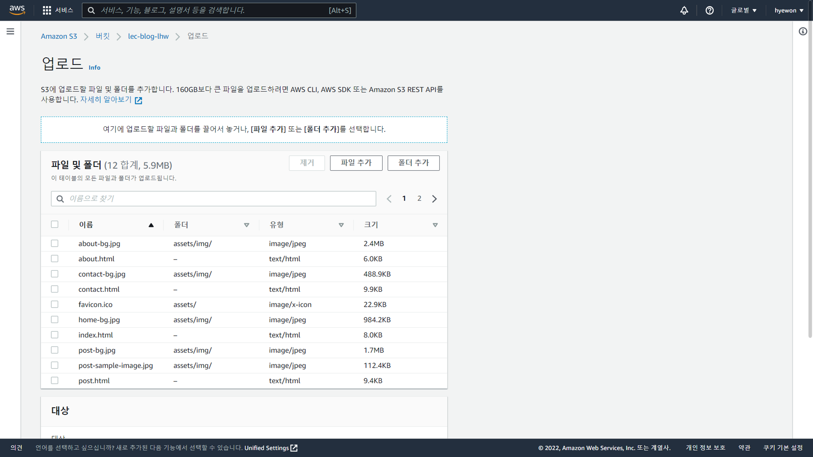

- [AWS S3 실습](#aws-s3-실습)
  - [개인 홈페이지 업로드](#개인-홈페이지-업로드)

# AWS S3 실습

## 개인 홈페이지 업로드

- start bootstrap : 템플릿 제공 무료 사이트
  
- 버킷에 템플릿 넣어서 초기 화면 엑세스하면 블로그가 될 수 있게
- 템플릿 다운로드 (zip 파일)
  
  
- 업로드
  
  
  - 업로드 성공
- 정적 웹 호스팅 편집
  
  
  - 시작 페이지 : `index.html`
- 정적 웹 사이트 호스팅 설정 완료
  
  - 버킷 웹 사이트 엔드포인트 생성
- 엔드포인트 클릭
  
  - 퍼블릭 엑세스 필요 → 버킷 단위 (파일 多)
- S3 → 버킷 → 버킷 선택 → 권한 → 버킷 정책 편집
  
  - S3 버킷 정책 차단
    ```json
    {
      "Version": "2012-10-17",
      "Statement": [
        {
          "Sid": "PublicReadGetObject",
          "Effect": "Allow",
          "Principal": "*",
          "Action": ["s3:GetObject"],
          "Resource": [
            "arn:aws:s3:::(Bucket-Name)/*" // 버킷명
          ]
        }
      ]
    }
    ```
- 엔드포인트
  
