- [Docker 실습-1](#docker-실습-1)
  - [Docker 설치](#docker-설치)
    - [Repository 인덱스 갱신](#repository-인덱스-갱신)
    - [Docker 다운로드 위해 필요한 패키지 설치](#docker-다운로드-위해-필요한-패키지-설치)
    - [`curl` 명령어로 Docker 다운로드](#curl-명령어로-docker-다운로드)
    - [Repository에 경로 추가](#repository에-경로-추가)
    - [Docker 설치](#docker-설치-1)
    - [Docker 설치 확인](#docker-설치-확인)

# Docker 실습-1

## Docker 설치

### Repository 인덱스 갱신

- `sudo apt update` : 최신 패키지로 저장소에 있는 패키지들 업데이트
  
  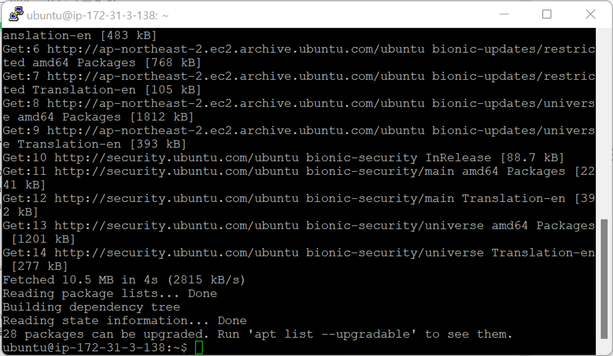
- `sudo apt-get upgrade` : 생략 가능
  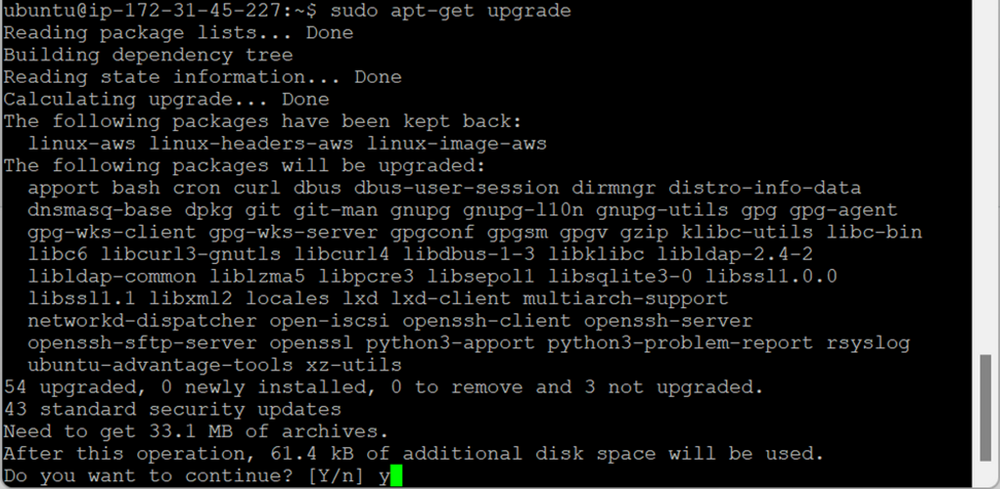
  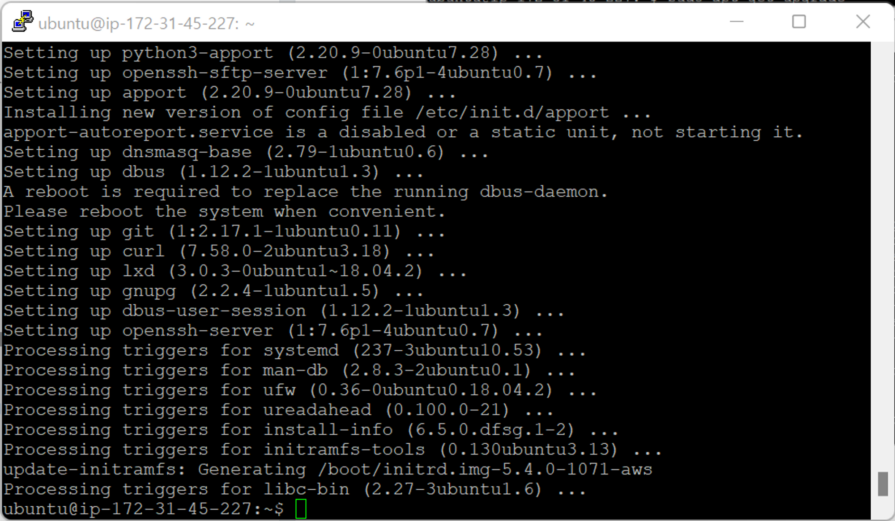

### Docker 다운로드 위해 필요한 패키지 설치

- `sudo apt install apt-transport-https`
  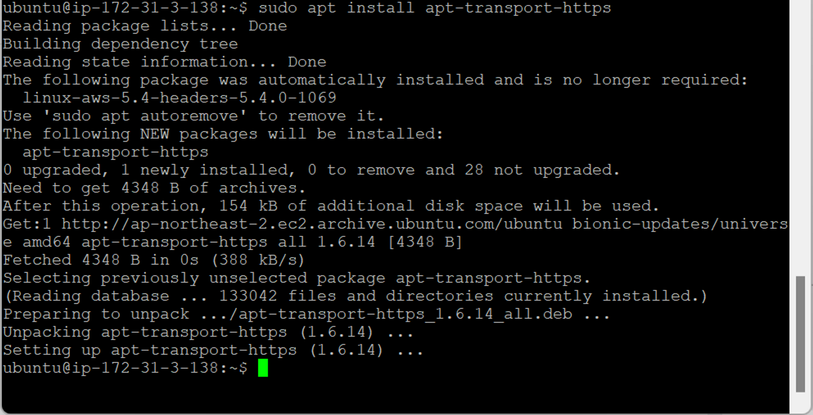
  - 패키지에 설치할 때 데이터, 패키지 → http 이용해서 접근 가능
  - ≒ apt-get : 패키지 다운로드
    - 웹 상에서 리눅스 패키지 저장해놓고 있는 사이트에 자동으로 연결해서 들어감
    - 기술되어 있는 것 보고 자동으로 패키지 가져옴
- `sudo apt install ca-certificates` : 디지털 서명 SSL 연결 여부 확인
  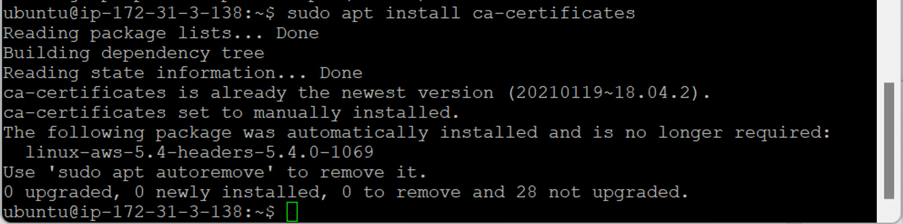
  - 패키지 검증 여부 확인
- `sudo apt install curl` : 특정 웹 사이트에서 데이터 다운로드 (필수)

  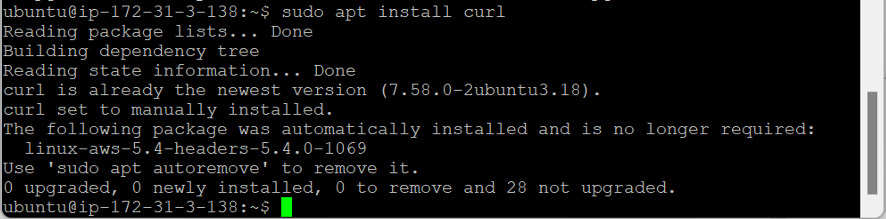

- `sudo apt install software-properties-common` : 소스 코드 패키지화 → 추가, 제거 가능 (필수)
  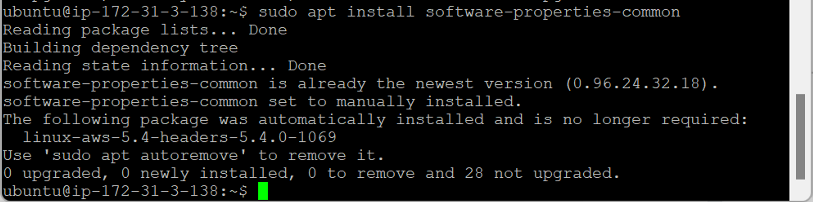

### `curl` 명령어로 Docker 다운로드

- `curl -fsSL https://download.docker.com/linux/ubuntu/gpg | sudo apt-key add`
  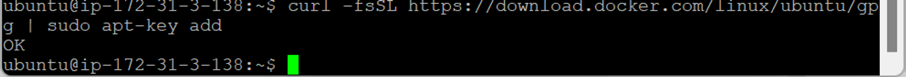

### Repository에 경로 추가

- `sudo add-apt-repository "deb [arch=amd64] https://download.docker.com/linux/ubuntu bionic stable"`

  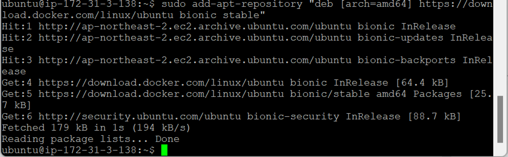

  - 추후 `sudo apt update` → Docker도 update 수행

- `sudo apt update` : Docker 사이트에 접속 후 업데이트
  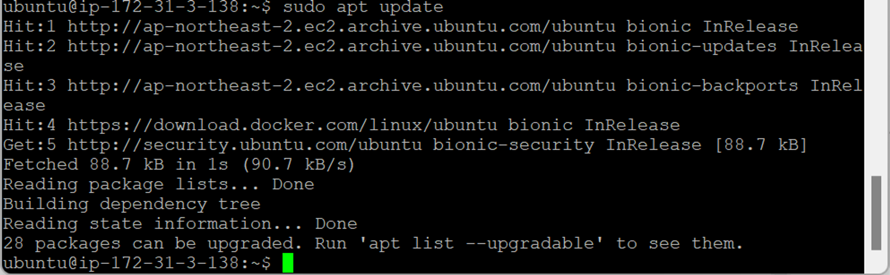
  - 다운로드 경로 파일에 Docker 다운로드 위치 추가됨

### Docker 설치

- `apt-cache policy docker-ce`

  

  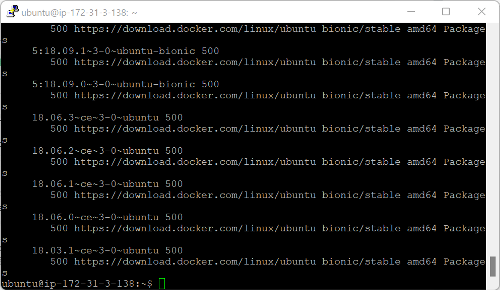

- `sudo apt install docker-ce`
  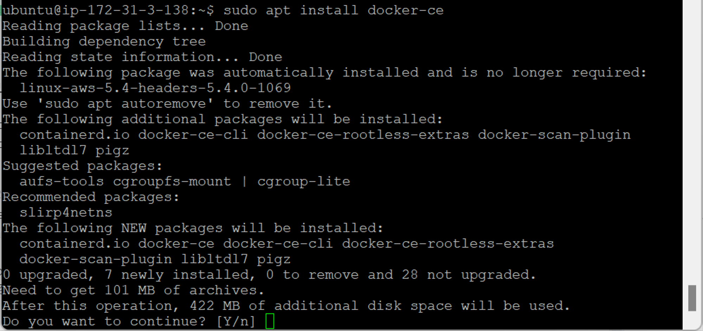
  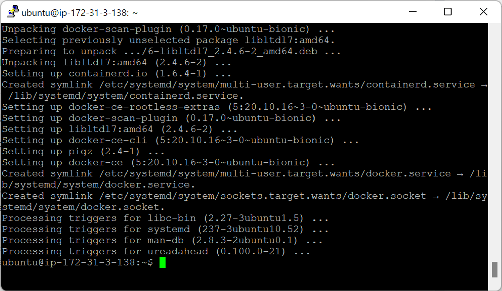

### Docker 설치 확인

- `sudo systemctl status docker`
  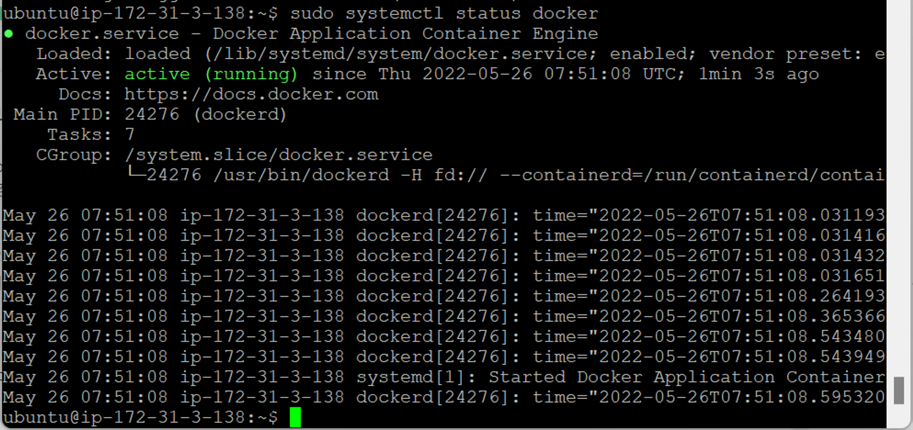
  - `active (running)` → 설치 완료
  - `q` : 탈출
