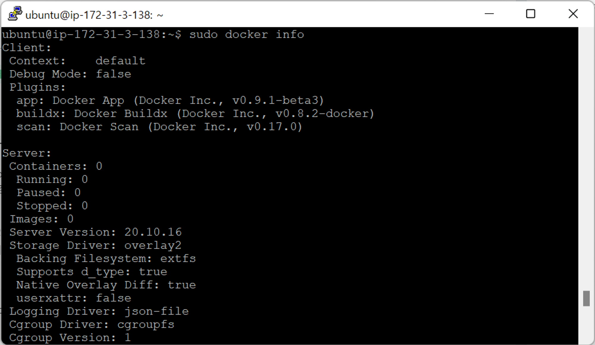
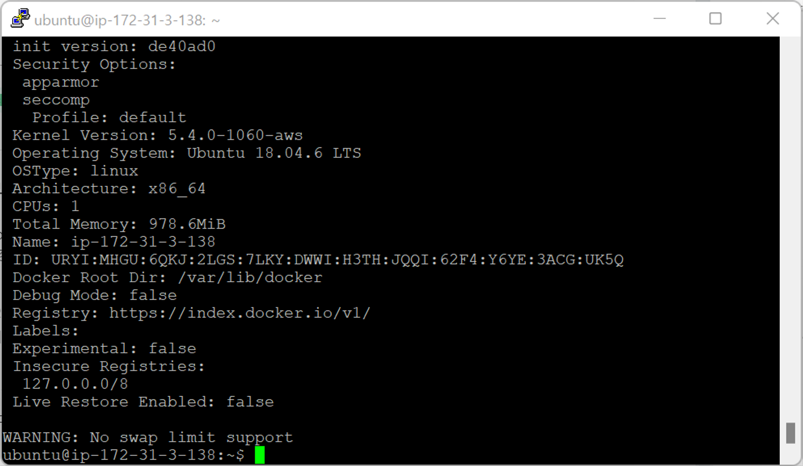
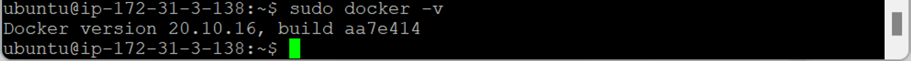
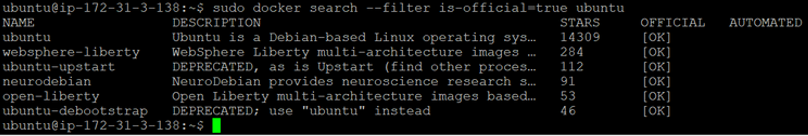
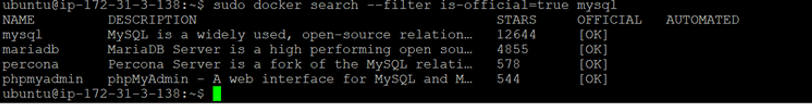
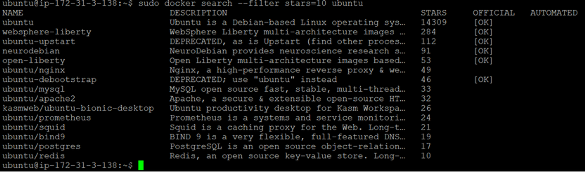

- [Docker 실습-1](#docker-실습-1)
  - [Docker 기본 명령어](#docker-기본-명령어)

# Docker 실습-1

## Docker 기본 명령어

- `sudo docker info` : 설치된 Docker의 상세 내역
  
  
- `sudo docker -v` : 설치된 Docker 버전 확인
  
- `sudo docker search --filter is-official=true (image_name)` : Docker Hub에서 이미지 검색
  
  
  - `--filter is-official=true` : 오피셜로 등록된 이미지만 검색
- `sudo docker search --filter stars=(min_num) (image_name)`
  
  - `--filter stars=(min_num)` : 최소 추천 수 이상인 이미지만 검색
