- [Docker 실습-1](#docker-실습-1)
  - [Hello world 이미지](#hello-world-이미지)
    - [이미지 받기](#이미지-받기)
    - [이미지 실행](#이미지-실행)
    - [컨테이너 삭제](#컨테이너-삭제)
    - [이미지 삭제](#이미지-삭제)

# Docker 실습-1

## Hello world 이미지

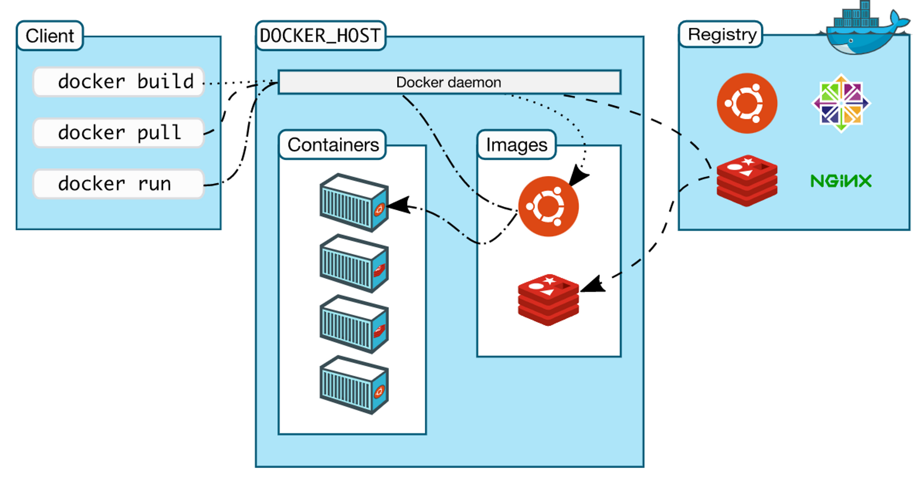

### 이미지 받기

- `sudo docker images` : 이미지 조회
  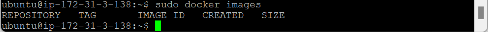
  - 이미지 없음
- `sudo docker pull (image_name)` : 이미지 받음
  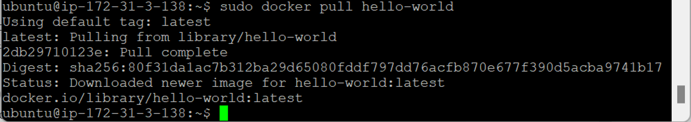
- `sudo docker images` : 이미지 조회
  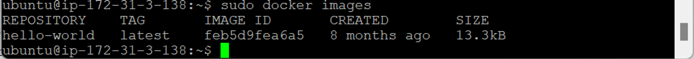

### 이미지 실행

- `sudo docker run (image_name)` : 컨테이너로 만든 후 실행
  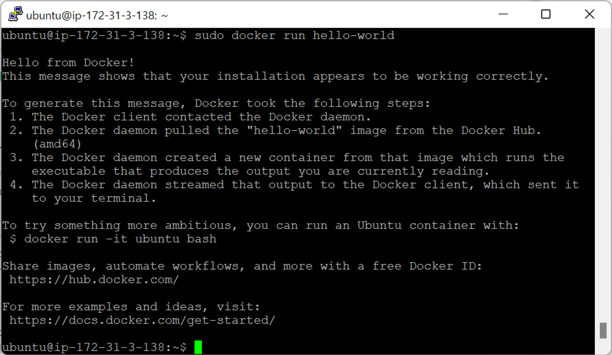
  - `sudo docker run (image_name)` : 자동으로 Docker 이름 생성
  - `sudo docker run --name (docker_name) (image_name)` : Docker 이름 지정 가능

### 컨테이너 삭제

- `sudo docker ps -a` : 컨테이너 생성 여부 확인
  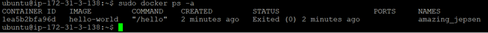
  - 컨테이너 이름 자동 생성 상태
  - `STATUS`
    - `Exited` : 컨테이너 실행 후 끝남
    - `UP` : 백그라운드에서 컨테이너 계속 실행 중
- `sudo docker rm (container_id)` : 컨테이너 삭제
  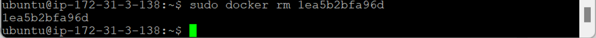
  - 해당 컨테이너 바로 삭제 → 가볍게 돌아감
- `sudo docker ps -a` : 프로세스 확인
  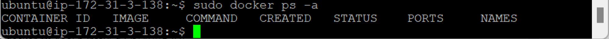
  - 컨테이너 삭제 완료

### 이미지 삭제

- `sudo docker images` : 이미지 확인
  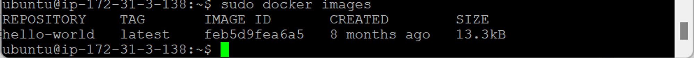
- `sudo docker rmi (image_name | image_id)` : 이미지 삭제
  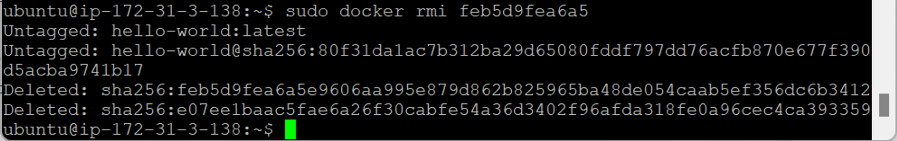
  - 해당 이미지를 통해 생성돼서 돌아가는 컨테이너 존재 → 삭제 불가
  - 컨테이너 먼저 지운 후 이미지 삭제 (동시에 지우는 명령어 존재)
- `sudo docker images` : 이미지 확인
  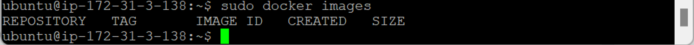
  - 이미지 삭제 완료
