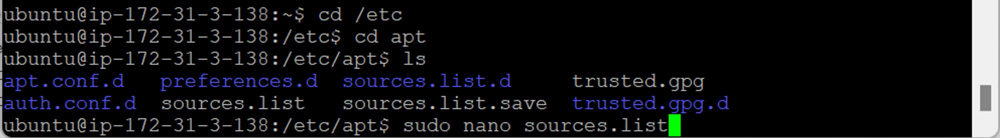
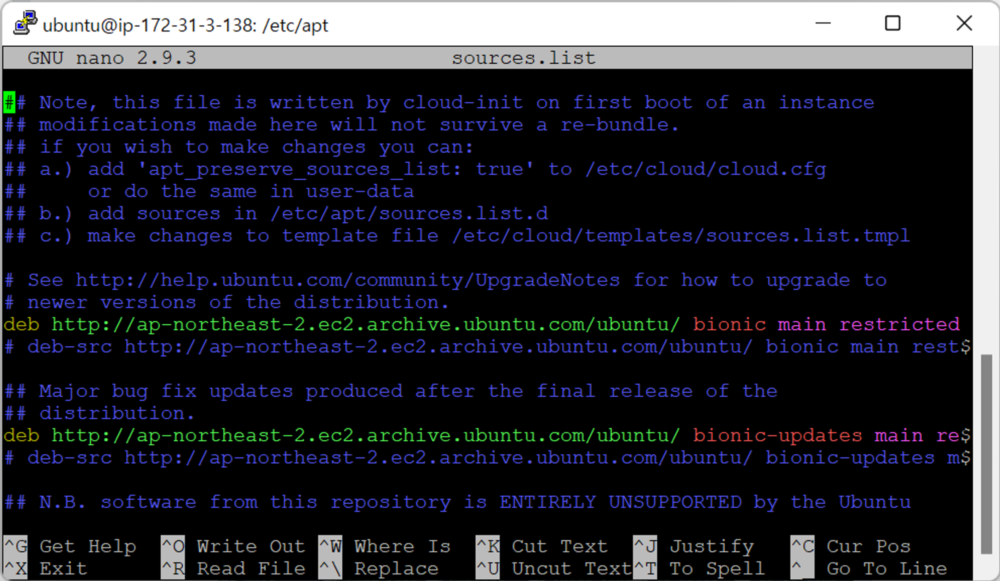
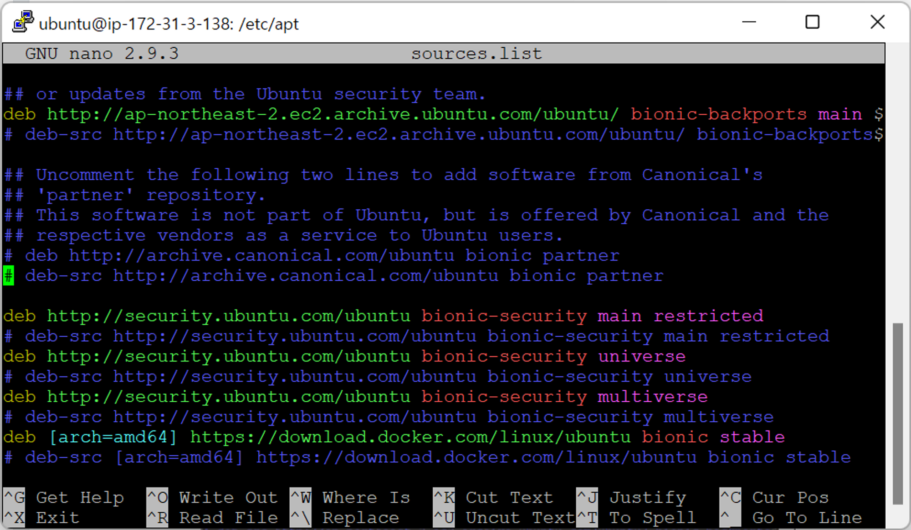

- [Docker 실습-1](#docker-실습-1)
  - [Repository 경로 추가 확인](#repository-경로-추가-확인)

# Docker 실습-1

## Repository 경로 추가 확인

- `apt-get` : 패키지 다운로드
  - 웹 상에서 리눅스 패키지를 저장해놓고 있는 사이트에 자동으로 연결
- Repository에 Docker Hub 경로 추가 확인
  
- `sudo nano sources.list`
  
  
  - 맨 아래 `bionic stable`에 Docker Hub URL 추가
    - `deb [arch=amd64] https://download.docker.com/linux/ubuntu bionic stable`
  - `sudo apt update` 시 Docker 관련 Docker 엔진도 같이 업데이트
