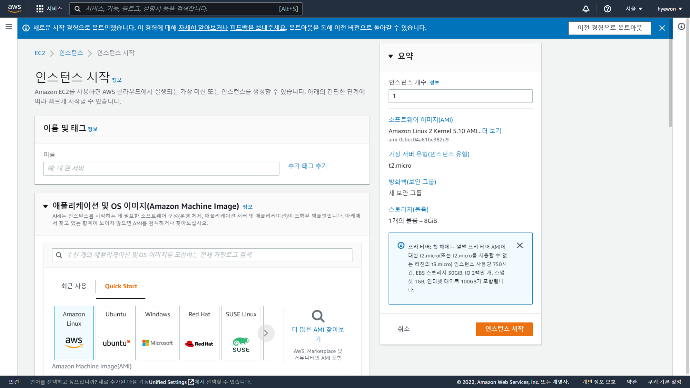
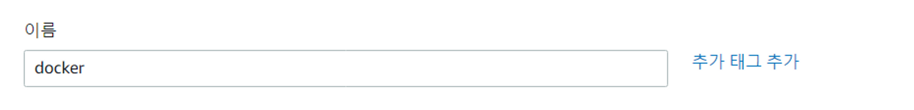
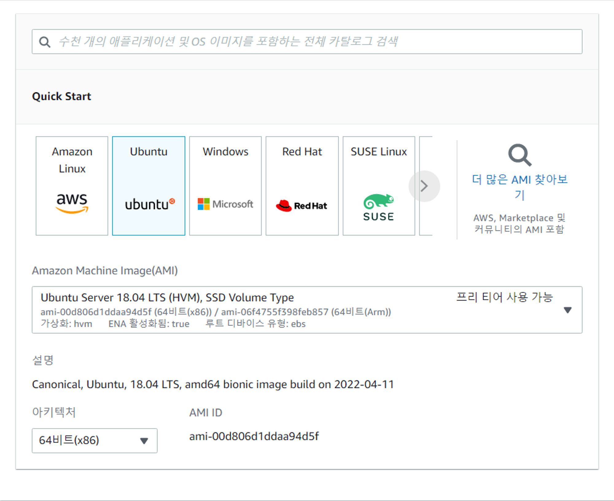
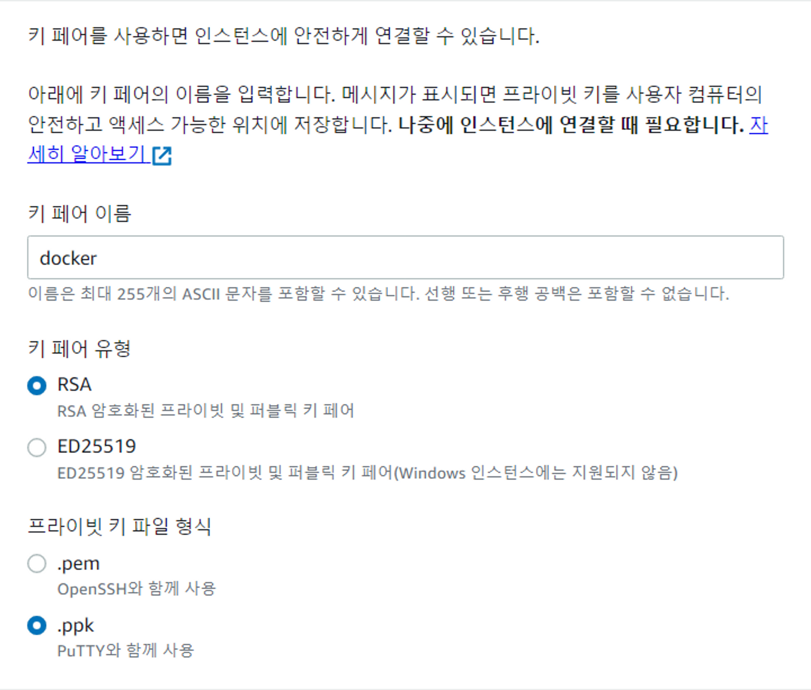
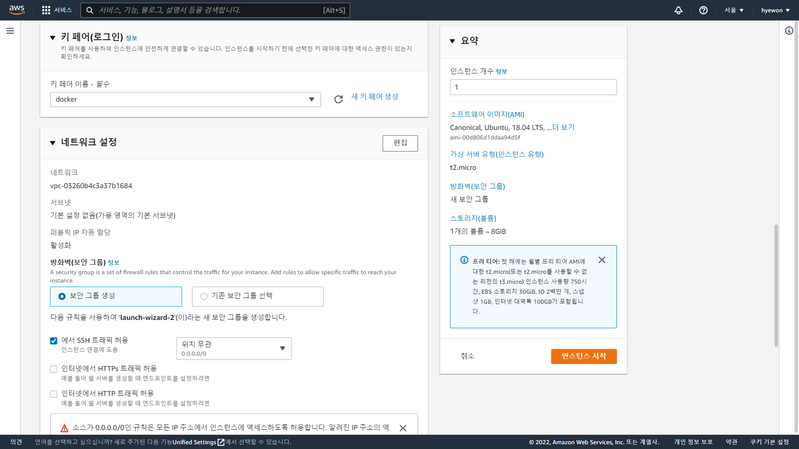
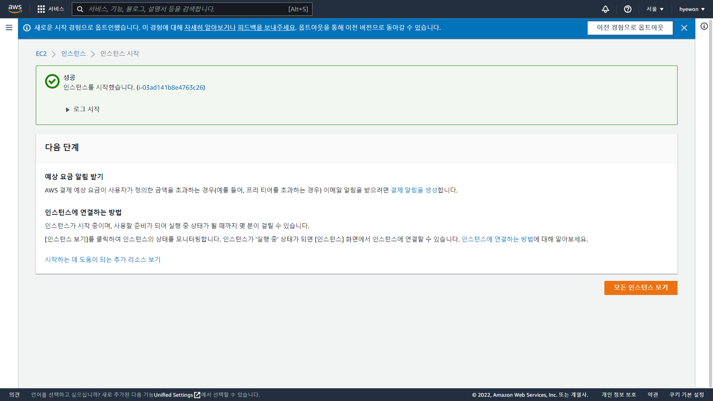
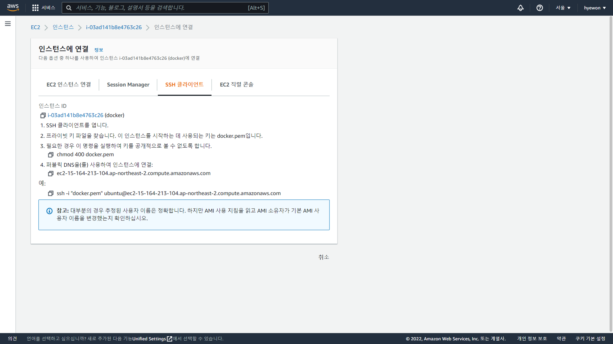

- [Docker 실습-2](#docker-실습-2)
  - [EC2 인스턴스 생성](#ec2-인스턴스-생성)

# Docker 실습-2

## EC2 인스턴스 생성

- EC2 → 인스턴스 → 인스턴스 시작
  
- **이름 및 태그**
  
- **애플리케이션 및 OS 이미지(Amazon Machine Image)**
  
- **키 페어(로그인) → 키페어 생성**
  
  - PuTTY → ppk 사용
- 인스턴스 시작
  
- 인스턴스 생성 성공
  
- EC2 → 인스턴스 → 인스턴스 ID → 연결
  
  - PuTTY : ubuntu@ec2-15-164-213-104.ap-northeast-2.compute.amazonaws.com
