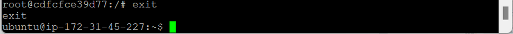

- [Docker 실습-2](#docker-실습-2)
  - [Docker 컨테이너 생성](#docker-컨테이너-생성)
    - [Docker 버전 확인](#docker-버전-확인)
    - [MySQL 5.6 버전 다운로드](#mysql-56-버전-다운로드)
    - [Docker 이미지 확인](#docker-이미지-확인)
    - [MySQL Docker 컨테이너 생성 및 실행](#mysql-docker-컨테이너-생성-및-실행)
    - [Docker 컨테이너 리스트 출력](#docker-컨테이너-리스트-출력)
    - [MySQL Docker 컨테이너 접속](#mysql-docker-컨테이너-접속)
    - [MySQL 명령어](#mysql-명령어)
    - [외부에서 Mysql 접속](#외부에서-mysql-접속)
    - [`exit`](#exit)
    - [MySQL Docker 컨테이너 시작/중지/재시작](#mysql-docker-컨테이너-시작중지재시작)

# Docker 실습-2

## Docker 컨테이너 생성

> RDS 이용해서 MySQL 따로 분리해서 서비스 X (인스턴스 생성 X)
>
> 우분투 위에 MySQL 컨테이너 이용
>
> MySQL 이미지 → Docker Hub에서 pull 받아서 컨테이너 생성

### Docker 버전 확인

- `docker -v`
  

### MySQL 5.6 버전 다운로드

- `sudo docker pull mysql:5.6`
  

### Docker 이미지 확인

- `sudo docker images`
  
  - MySQL 다운로드 완료
  - `TAG` : 버전

### MySQL Docker 컨테이너 생성 및 실행

- `sudo docker run --name (container_name) -e MYSQL_ROOT_PASSWORD=(password) -d -p (port_num):3306 (image_name)`
  
  - `sudo docker run` : 컨테이너 실행
  - `--name (container_name)` : 컨테이너 이름 설정
  - `-e MYSQL_ROOT_PASSWORD=(password)` : root 유저 비밀번호 설정
    - MySQL 생성과 동시에 root 유저 생성
  - `-d` : detached → 자동으로 들어가지 X
  - `-p (port_num):3306` : 포트 번호 설정 (host 포트:컨테이너 포트)
    

    - MySQL : 외부와 데이터 주고 받음 → 전용 통신 포트 필요 (3306)
      - host의 특정 포트까지만 연결 → 다시 외부와 통신 필요
      - 놀고 있는 아무 포트 지정
    - 컨테이너 안에 MySQL이 작동하는데 필요한 기본 커널 존재 → MySQL 서버처럼

### Docker 컨테이너 리스트 출력

- `sudo docker ps -a`
  
  - `STATUS` : `UP` → 컨테이너 생성

### MySQL Docker 컨테이너 접속

- `sudo docker exec -it (container_name) /bin/bash`
  
  - `-it` : interactive + tty → 입력 컨테이너로 전달
  - `/bin/bash` : 쉘 프롬프트 위치 → bash 쉘
    - 컨테이너 내 기본적인 리눅스 커널 존재
    - 우분투 설치 X → 우분투 서버에 있는 것처럼 느낌
  - `#` : root 유저 프롬프트
- `mysql -u root -p` : MySQL 서버에서 DB 접속
  
  - `mysql -u root -p (password)` : 비밀번호 생략 가능 → 엔터 후 입력

### MySQL 명령어

- `show databses;` : DB 확인
  
- `use mysql` : `mysql` DB 접속
  
- `show tables;` : 테이블 조회
  
  

### 외부에서 Mysql 접속

- Toad for MySQL
  
  - Host : 퍼블릭 IPv4주소 (컨테이너 돌아가고 있는 host의 엔드포인트)
  - Port : 컨테이너 사용 → 호스트 서버 포트
  - Connect 오류 → 호스트 서버 포트 사용하기 위해 인바운드 규칙 추가 필요
- EC2 → 보안 그룹 → 인바운드 규칙 편집
  
- Connect 성공
  

### `exit`

- `exit` : MySQL 종료
  
- `exit` : Docker 컨테이너 쉘 종료
  

### MySQL Docker 컨테이너 시작/중지/재시작

- `sudo docker ps -a` : 실행 프로세스 확인
  
  - `STATUS` : `UP` → 컨테이너 실행 중 (삭제 X)
- `sudo docker stop mysql-lecture` : MySQL Docker 컨테이너 중지
- `sudo docker start mysql-lecture` : MySQL Docker 컨테이너 시작
- `sudo docker restart mysql-lecture` : MySQL Docker 컨테이너 재시작
