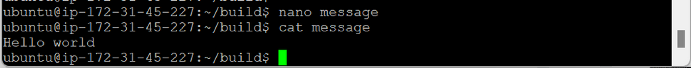

- [Docker 실습-2](#docker-실습-2)
  - [Docker 이미지 생성](#docker-이미지-생성)
    - [Dockerfile 작성할 디렉토리 만들기](#dockerfile-작성할-디렉토리-만들기)
    - [Dockerfile에 저장할 message 생성](#dockerfile에-저장할-message-생성)
    - [Dockerfile 생성](#dockerfile-생성)
    - [이미지 빌드 (생성)](#이미지-빌드-생성)
    - [이미지 생성 확인](#이미지-생성-확인)
    - [이미지 실행](#이미지-실행)

# Docker 실습-2

## Docker 이미지 생성

- `docker pull` : Docker Hub에서 사용할 이미지 다운로드
- `docker run` : 이미지로 컨테이너 만들어서 실행
- `docker rmi` : 이미지 삭제
  - 이미지 통해 생성된 컨테이너 존재 시 삭제 X
  - 컨테이너 삭제 필요
- `docker build` : 소스 이미지 + 기능 추가 → 이미지 생성
  - `sudo docker build --tag (image_name)`
  - 작업 디렉터리 Dockerfile → 작업 내용 기술 (작업 지시서)
  - 단계적으로 작성 → 한번에 빌드 (쉘 프로그래밍)
    1. 원천 이미지
    2. 기능 추가
    3. 특별 처리

### Dockerfile 작성할 디렉토리 만들기

- `mkdir (dir_name)`
  
- `cd (dir_name)`
  

### Dockerfile에 저장할 message 생성

- `sudo apt-get install figlet` : 예쁜 글씨로 출력하는 패키지 다운로드
- `figlet -c hello`
  
- `sudo apt-get install lolcat` : 글씨에 색 입히는 패키지 다운로드
- `figlet -c hello | lolcat -a -s 500`
  

### Dockerfile 생성

- `nano Dockerfile`
  
  - `Dockerfile` → 대문자 주의
  - `alpine` : pull 기본 소스 이미지 (기본 글씨 예쁘게 만들어주는 자동 OS)
  - `latest` : 최신 버전
- message 파일 생성
  
- `nano Dockerfile`
  
  - `RUN apk update && apk add figlet` : 컨테이너에서 생성
    - `apk` : `alpine` OS에서 사용하는 명령어
    - `&&` : 동시에 실행
    - `add (package_name)` : 패키지 → 이미지로 업데이트
  - `ADD ./message /message` : 컨테이너에 추가
    - `./(file_name)` : 현재 디렉터리에 있는 `message` 파일
    - `/(file_name)` : 컨테이너 → 루트 디렉터리에 배치
  - `CMD cat /message | figlet` : 컨테이너 기동 직후 실행
    - `cat (file_name)` 결과 → `figlet` 커맨드의 표준 입력으로 전달
- `ls -l`
  
  - Docker가 빌드할 때 보는 사용설명서 생성
  - 작업 내용 기재

### 이미지 빌드 (생성)

- `sudo docker build --tag (image_name):(tag) .`
  
  
  - `.` : 파일 저장 위치 (현재 위치) → 앞에 반드시 빈칸
  - `Successfully` : 성공

### 이미지 생성 확인

- `sudo docker images`
  

### 이미지 실행

- `sudo docker run (image_name):(tag)`
  
