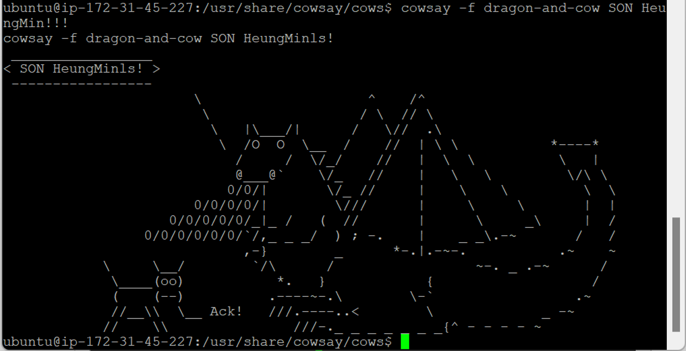

- [Docker 실습-2](#docker-실습-2)
  - [재미있는 패키지 (cowsay)](#재미있는-패키지-cowsay)

# Docker 실습-2

## 재미있는 패키지 (cowsay)

- `sudo apt-get install cowsay`

  

- `cowsay (text)`
  
- `cd /usr/share/cowsay/cows/` : 변경 가능 동물 조회
  
- `cowsay -f dragon-and-cow (text)`
  
- `cowsay -f dragon-and-cow (text) | lolcat -a -s 500` : 색 변경 패키지

  
